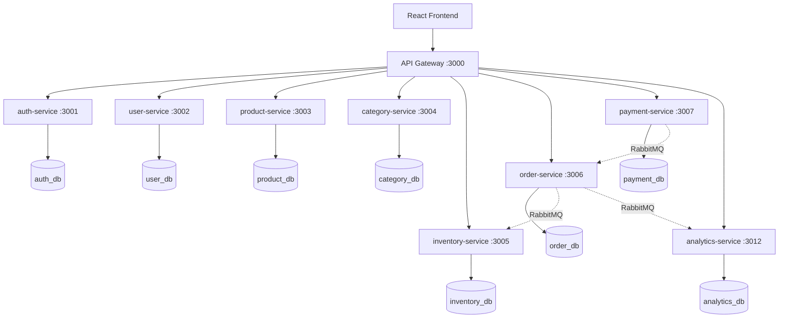

#  Coffee Shop Management System

Hệ thống quản lý quán cà phê theo kiến trúc **Microservices** — 9 dịch vụ, React frontend, API Gateway, Docker, giám sát đầy đủ.

**Tác giả:** Đào Văn Phong

---

## 🏗️ Kiến trúc



### Nguyên tắc thiết kế

| Nguyên tắc | Cách triển khai |
|---|---|
| **Database per Service** | 8 CSDL MySQL riêng biệt |
| **API Gateway** | Express Gateway tại cổng 3000 |
| **Đồng bộ + Bất đồng bộ** | REST API + RabbitMQ |
| **Circuit Breaker** | Tự động ngắt khi service lỗi |
| **Saga Pattern** | Giao dịch phân tán có bù trừ |
| **RBAC** | 6 cấp độ phân quyền |

---

## 🛠️ Công nghệ

| Lớp | Công nghệ |
|---|---|
| **Frontend** | React 18, Redux, Tailwind CSS, Axios |
| **Backend** | Node.js, Express, JWT, Socket.IO |
| **Database** | MySQL 8.0 (8 CSDL riêng) |
| **Cache** | Redis 7 |
| **Message Queue** | RabbitMQ |
| **Giám sát** | Prometheus, Grafana, Jaeger, ELK |
| **Service Discovery** | Consul |
| **Container** | Docker, Docker Compose (20 containers) |

---

## 🚀 Cài đặt & Chạy

### Yêu cầu

- Node.js 18+
- Docker & Docker Compose

### Chạy toàn bộ hệ thống

```bash
git clone https://github.com/ngphong01/SOA-Coffee.git
cd SOA-Coffee
docker-compose up -d
docker-compose exec api-gateway npm run db:init
```

### Chạy development

```bash
docker-compose -f docker-compose.dev.yml up -d
cd services/auth-service && npm run dev   # mỗi service chạy riêng
cd api-gateway && npm run dev
cd frontend && npm run dev
```

### Truy cập

| Thành phần | URL |
|---|---|
| Frontend | http://localhost |
| API + Swagger | http://localhost:3000/api/docs |
| Grafana | http://localhost:3008 |
| RabbitMQ UI | http://localhost:15672 |
| Jaeger | http://localhost:16686 |

---

## 📡 API (60+ endpoints)

> Xem đầy đủ tại: http://localhost:3000/api/docs

| Method | Endpoint | Mô tả | Auth |
|---|---|---|---|
| `POST` | `/api/auth/login` | Đăng nhập | Không |
| `GET` | `/api/products` | Danh sách sản phẩm | Không |
| `POST` | `/api/products` | Thêm sản phẩm | Admin |
| `GET` | `/api/orders` | Danh sách đơn hàng | Có |
| `POST` | `/api/orders` | Tạo đơn hàng | Có |

**Response format:**

```json
{
  "success": true,
  "statusCode": 200,
  "message": "Thành công",
  "data": {},
  "timestamp": "2026-07-01"
}
```

---

## 📁 Cấu trúc dự án

```
coffee-shop-system/
├── api-gateway/          # Cổng API (10 middleware)
├── frontend/             # React App (34 trang)
├── services/             # 8 Microservices
│   ├── auth-service/     # Xác thực JWT
│   ├── user-service/     # Quản lý người dùng
│   ├── product-service/  # Sản phẩm (SKU, barcode)
│   ├── category-service/ # Danh mục (cha-con)
│   ├── inventory-service/# Tồn kho (cảnh báo)
│   ├── order-service/    # Đơn hàng (Saga, Socket.IO)
│   ├── payment-service/  # Thanh toán (tiền mặt/thẻ/ví)
│   └── analytics-service/# Phân tích doanh thu
├── shared/               # Redis, RabbitMQ, Logger...
├── config/               # Prometheus, Grafana
├── tests/                # Unit & Integration tests
└── docker-compose.yml    # 20 containers
```

---

## ⚡ Tính năng nổi bật

- 🔐 **JWT + RBAC** — 6 cấp độ phân quyền
- 🛒 **Saga Pattern** — Giao dịch phân tán có bù trừ
- 📊 **Dashboard** — Doanh thu, sản phẩm bán chạy, lưu lượng
- ⚡ **Realtime** — Trạng thái đơn hàng qua Socket.IO
- 🛡️ **Circuit Breaker** — Tự ngắt khi service lỗi
- 📈 **Monitoring** — Prometheus + Grafana + Jaeger + ELK
- 🔒 **Bảo mật** — Helmet, AES-256, audit logs

---

## 👤 Tác giả

**Đào Văn Phong**

---

## 📄 License

MIT
