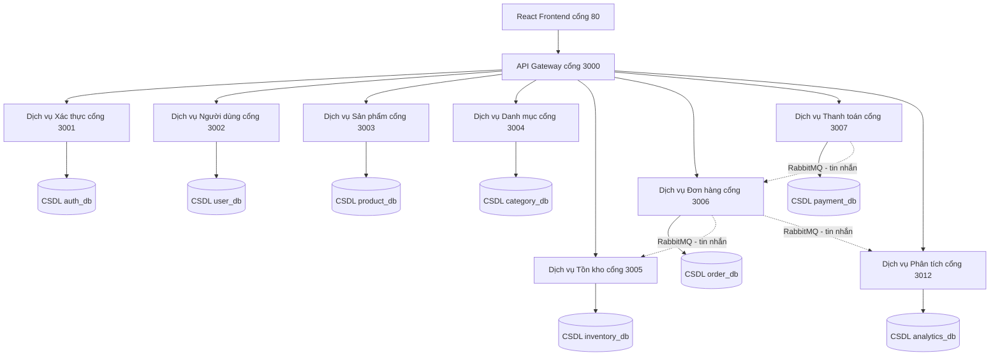
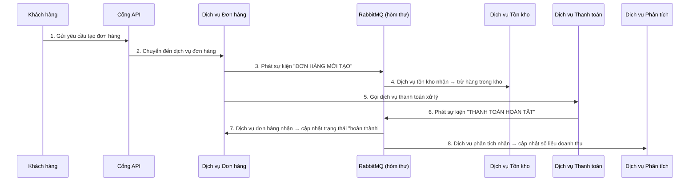

# Coffee Shop Management System

Hệ thống quản lý quán cà phê quy mô doanh nghiệp, xây dựng theo kiến trúc Microservices với 9 dịch vụ, giao diện React, API Gateway và đầy đủ công cụ giám sát.

---


### 1.1. Kiến trúc Microservice trong dự án

Dự án **Coffee Shop Management System** được thiết kế theo kiến trúc **Microservices** (kiến trúc vi dịch vụ). Thay vì viết một khối code khổng lồ (kiểu nguyên khối - Monolithic), hệ thống được chia thành nhiều dịch vụ nhỏ, mỗi dịch vụ đảm nhận một nhiệm vụ riêng biệt và chạy độc lập.

**Sơ đồ kiến trúc tổng quan — cách đọc sơ đồ:**

> - Mỗi **hình chữ nhật** là một dịch vụ (service) riêng biệt
> - **Mũi tên liền nét (→)** thể hiện giao tiếp trực tiếp qua REST API (đồng bộ - synchronous): Client gửi request và chờ phản hồi ngay
> - **Mũi tên đứt nét (-.->)** thể hiện giao tiếp qua RabbitMQ (bất đồng bộ - asynchronous): Gửi sự kiện, không chờ phản hồi
> - **Hình trụ tròn [(DB)]** là cơ sở dữ liệu MySQL của từng dịch vụ



#### 🔑 Các nguyên tắc thiết kế Microservice trong dự án:

| Nguyên tắc (Tiếng Anh)         | Giải thích (Tiếng Việt)            | Cách triển khai trong dự án                                             |
| ------------------------------ | ---------------------------------- | ----------------------------------------------------------------------- |
| **Database per Service**       | Mỗi dịch vụ có cơ sở dữ liệu riêng | 8 CSDL MySQL riêng biệt, không chia sẻ bảng                             |
| **Decentralized Governance**   | Quản trị phi tập trung             | Mỗi dịch vụ chạy trong Docker container độc lập, có thể deploy riêng    |
| **API Gateway Pattern**        | Cổng API duy nhất                  | Express API Gateway tại cổng 3000 — mọi request từ frontend đều qua đây |
| **Interservice Communication** | Giao tiếp giữa các dịch vụ         | REST (đồng bộ) + RabbitMQ (bất đồng bộ qua tin nhắn)                    |
| **Circuit Breaker**            | Cầu dao tự động ngắt               | Tự code `CircuitBreaker` với 3 trạng thái: ĐÓNG → MỞ → NỬA MỞ           |
| **Service Discovery**          | Tự động phát hiện dịch vụ          | Tích hợp Consul qua file `serviceDiscovery.js`                          |

### 1.2. Thiết kế RESTful API

Dự án sử dụng **REST** (Representational State Transfer — kiểu kiến trúc API dùng HTTP). Không dùng SOAP (Simple Object Access Protocol — giao thức cũ dùng XML nặng hơn).

**Sơ đồ luồng xử lý một request REST — cách đọc:**

> - **Client** (trình duyệt/máy khách) gửi yêu cầu HTTP (GET/POST/PUT/DELETE)
> - **API Gateway** nhận request, kiểm tra xác thực (JWT), kiểm tra quyền (RBAC), rồi chuyển tiếp đến dịch vụ phù hợp
> - **Service** xử lý logic nghiệp vụ, đọc/ghi CSDL, trả kết quả về

```
Trình duyệt (React)                   API Gateway (cổng 3000)               Dịch vụ Sản phẩm (cổng 3003)
     │                                       │                                      │
     │  GET /api/products                    │                                      │
     │──────────────────────────────────────>│                                      │
     │                                       │  Kiểm tra JWT token                  │
     │                                       │  Kiểm tra quyền RBAC                 │
     │                                       │  Chuyển tiếp request                 │
     │                                       │─────────────────────────────────────>│
     │                                       │                                      │──> Truy vấn CSDL product_db
     │                                       │                                      │<── Kết quả từ CSDL
     │                                       │  Trả về JSON                        │
     │                                       │<─────────────────────────────────────│
     │  Nhận JSON kết quả                    │                                      │
     │<──────────────────────────────────────│                                      │
     │                                       │                                      │
     │  Hiển thị danh sách sản phẩm          │                                      │
```

**Ví dụ API endpoints trong dự án (file swagger.js):**

| Phương thức HTTP | Đường dẫn (Endpoint) | Mục đích                     | Cần đăng nhập?     |
| ---------------- | -------------------- | ---------------------------- | ------------------ |
| `POST`           | `/api/auth/login`    | Đăng nhập, nhận JWT token    | Không              |
| `POST`           | `/api/auth/register` | Đăng ký tài khoản mới        | Không              |
| `GET`            | `/api/products`      | Xem danh sách sản phẩm       | Không              |
| `GET`            | `/api/products/123`  | Xem chi tiết sản phẩm số 123 | Không              |
| `POST`           | `/api/products`      | Tạo sản phẩm mới             | Có (admin/manager) |
| `PUT`            | `/api/products/123`  | Cập nhật sản phẩm 123        | Có (admin/manager) |
| `DELETE`         | `/api/products/123`  | Xóa sản phẩm 123             | Có (admin/manager) |
| `GET`            | `/api/orders`        | Xem danh sách đơn hàng       | Có                 |
| `POST`           | `/api/orders`        | Tạo đơn hàng mới             | Có                 |

**Các chuẩn REST được áp dụng trong dự án:**

- ✅ **Stateless** (Không trạng thái): Dùng JWT token — mỗi request tự mang thông tin xác thực, server không lưu phiên (session)
- ✅ **Resource-based URLs** (URL dựa trên tài nguyên): `/products` cho sản phẩm, `/orders` cho đơn hàng — URL phản ánh đối tượng cần thao tác
- ✅ **HTTP Methods chuẩn**:
  - `GET` = đọc dữ liệu (không thay đổi gì)
  - `POST` = tạo mới
  - `PUT` = cập nhật toàn bộ
  - `DELETE` = xóa
- ✅ **Response format thống nhất** (Định dạng trả về): Mọi API đều trả về cùng một cấu trúc JSON:
  ```json
  {
    "success": true,          // thành công hay thất bại?
    "statusCode": 200,        // mã trạng thái HTTP
    "message": "Thành công",  // thông báo
    "data": { ... },          // dữ liệu chính
    "timestamp": "2026-06-25" // thời điểm xử lý
  }
  ```
- ✅ **API Documentation** (Tài liệu API): Swagger UI tại `/api/docs` — giao diện trực quan để xem và thử tất cả API

### 1.3. SOAP vs REST — Tại sao chọn REST?

| Tiêu chí              | SOAP                            | REST (dự án chọn)                        |
| --------------------- | ------------------------------- | ---------------------------------------- |
| **Định dạng dữ liệu** | XML (nặng, khó đọc)             | JSON (nhẹ, dễ đọc)                       |
| **Tốc độ xử lý**      | Chậm (parse XML phức tạp)       | Nhanh (parse JSON đơn giản)              |
| **Trạng thái**        | Có thể có trạng thái (stateful) | Không trạng thái (stateless) — dùng JWT  |
| **Dùng cho**          | Ngân hàng, hệ thống lớn cũ      | Web, mobile apps, microservices hiện đại |
| **Độ phức tạp**       | Cao (cần WSDL, nhiều quy tắc)   | Thấp (dựa trên HTTP có sẵn)              |

**Lý do chọn REST:** Coffee shop là hệ thống web/mobile hiện đại, cần tốc độ cao, giao tiếp nhẹ giữa React frontend → API Gateway → Microservices. REST + JSON đơn giản, nhanh và được hỗ trợ rộng rãi hơn SOAP.

---

## 📘 CÂU 2: CLO2 — Áp dụng hoạt động phát triển phần mềm hướng dịch vụ

### 2.1. Phân tích nghiệp vụ (Domain Analysis)

**Bài toán thực tế:** Quản lý chuỗi cửa hàng cà phê — cần xử lý: sản phẩm, danh mục, tồn kho, đơn hàng, thanh toán, khách hàng, nhân viên, báo cáo doanh thu.

Hệ thống được chia thành **9 Bounded Contexts** (ngữ cảnh giới hạn — mỗi ngữ cảnh là một phạm vi nghiệp vụ rõ ràng):

| Bounded Context (Ngữ cảnh)               | Dịch vụ (Service) | Trách nhiệm chính                                                                   |
| ---------------------------------------- | ----------------- | ----------------------------------------------------------------------------------- |
| **Authentication** (Xác thực)            | auth-service      | Đăng nhập/đăng ký, tạo JWT token, làm mới token, ghi nhật ký hoạt động              |
| **User Management** (Quản lý người dùng) | user-service      | Hồ sơ khách hàng, nhân viên, cài đặt cửa hàng, upload ảnh                           |
| **Product Catalog** (Danh mục sản phẩm)  | product-service   | Thêm/sửa/xóa sản phẩm, mã SKU, mã vạch (12 sản phẩm mẫu)                            |
| **Category** (Danh mục)                  | category-service  | Phân loại sản phẩm (5 danh mục: Cà phê, Trà, Sinh tố, Bánh, Khác), phân cấp cha-con |
| **Inventory** (Tồn kho)                  | inventory-service | Số lượng tồn, nhập/xuất kho, cảnh báo sắp hết hàng                                  |
| **Order Processing** (Xử lý đơn)         | order-service     | Tạo đơn, theo dõi trạng thái, cập nhật realtime qua Socket.IO                       |
| **Payment** (Thanh toán)                 | payment-service   | Xử lý thanh toán (tiền mặt, thẻ, ví), hoàn tiền                                     |
| **Analytics** (Phân tích)                | analytics-service | Bảng điều khiển, doanh thu, sản phẩm bán chạy, lưu lượng theo giờ                   |
| **API Gateway** (Cổng API)               | api-gateway       | Định tuyến, xác thực, phân quyền, giới hạn tốc độ, cache                            |

### 2.2. Giao tiếp giữa các Dịch vụ

Có **2 kiểu giao tiếp** trong hệ thống:

#### 🔄 Kiểu 1: Đồng bộ (Synchronous) — Gửi và chờ phản hồi ngay

Dùng REST API qua HTTP. Client gửi request và đợi response ngay lập tức.

**Ví dụ:** Khách xem danh sách sản phẩm:

```
Người dùng (React) → API Gateway → Product Service → CSDL product_db → Trả về JSON
```

#### 📨 Kiểu 2: Bất đồng bộ (Asynchronous) — Gửi sự kiện, không chờ

Dùng RabbitMQ (hàng đợi tin nhắn — giống như hòm thư: bên gửi bỏ thư vào, bên nhận lấy ra xử lý sau).

**Sơ đồ luồng sự kiện đặt hàng — cách đọc:**

> - Mỗi **hộp dọc** là một thành phần tham gia
> - **Mũi tên xuống** thể hiện thời gian trôi từ trên xuống dưới
> - **Mũi tên ngang (->>)** là gửi yêu cầu/thông điệp
> - **Mũi tên đứt nét (-->>) ** là phản hồi



**Các sự kiện được định nghĩa trong file `events.js`:**

| Sự kiện (Event)                       | Ai phát đi?     | Ai nhận?          | Hành động khi nhận                                  |
| ------------------------------------- | --------------- | ----------------- | --------------------------------------------------- |
| `order.created` (đơn hàng mới)        | order-service   | inventory-service | Tự động trừ số lượng tồn kho                        |
| `order.created` (đơn hàng mới)        | order-service   | analytics-service | Tăng số đơn hàng trong ngày                         |
| `payment.completed` (thanh toán xong) | payment-service | order-service     | Cập nhật đơn hàng thành "hoàn thành"                |
| `payment.completed` (thanh toán xong) | payment-service | analytics-service | Cập nhật doanh thu, thống kê phương thức thanh toán |

### 2.3. Giao dịch phân tán — Saga Pattern

**Vấn đề:** Một đơn hàng cần thao tác trên nhiều dịch vụ (tạo đơn → giữ hàng → thanh toán). Nếu một bước thất bại giữa chừng, cần hoàn tác các bước trước đó.

**Giải pháp: Saga Pattern** (mẫu giao dịch phân tán) — mỗi bước có một hành động bù trừ (compensating action) để hoàn tác nếu có lỗi.

**Sơ đồ Saga — cách đọc:**

> - Các bước chạy từ trên xuống dưới
> - Mỗi bước có: **Hành động chính** (Action) và **Hành động bù trừ** (Compensate - chỉ chạy khi có lỗi)
> - ✅ = thành công, ❌ = thất bại, ↩ = chạy bù trừ ngược

```
BƯỚC 1: Tạo đơn hàng
   ├─ Action:      Gọi order-service tạo đơn mới          ✅
   └─ Compensate:  Gọi order-service hủy đơn (nếu lỗi)    ↩ (chỉ khi lỗi)

BƯỚC 2: Giữ hàng trong kho
   ├─ Action:      Gọi inventory-service giảm tồn kho      ❌ (lỗi: hết hàng!)
   └─ Compensate:  Gọi inventory-service trả lại hàng      ↩ ĐÃ CHẠY

BƯỚC 3: Quay lại bước 1 — chạy bù trừ
   └─ Compensate:  Hủy đơn hàng đã tạo                     ↩ ĐÃ CHẠY

KẾT QUẢ: Giao dịch thất bại an toàn — đơn hàng bị hủy, không mất hàng, không mất tiền!
```

**Code thực tế trong file `sagaOrchestrator.js`:**

```javascript
const createOrderSaga = (orderApi, inventoryApi, paymentApi) => {
  return new SagaOrchestrator()
    .step(
      'create_order',        // Bước 1: Tạo đơn hàng
      async (ctx) => orderApi.create(ctx.orderData),       // Hành động chính
      async (ctx) => orderApi.cancel(ctx.orderId)          // Bù trừ: Hủy đơn
    )
    .step(
      'reserve_inventory',   // Bước 2: Giữ hàng
      async (ctx) => inventoryApi.reserve(ctx.items),       // Hành động chính
      async (ctx) => inventoryApi.release(ctx.items)        // Bù trừ: Trả hàng
    )
    .step(
      'process_payment',     // Bước 3: Thanh toán
      async (ctx) => paymentApi.process({...}),             // Hành động chính
      async (ctx) => paymentApi.refund(ctx.paymentId)       // Bù trừ: Hoàn tiền
    );
};
```

### 2.4. Các mối quan tâm xuyên suốt (Cross-cutting Concerns)

Tất cả các chức năng dùng chung được xử lý tại **API Gateway** theo pipeline (đường ống xử lý tuần tự):

```
Request (Yêu cầu từ client)
    │
    ▼
[1] Helmet — Thêm header bảo mật (chống tấn công XSS, clickjacking...)
    │
    ▼
[2] CORS — Cho phép frontend từ domain khác gọi API
    │
    ▼
[3] CorrelationID — Gắn mã định danh duy nhất cho mỗi request (để trace log)
    │
    ▼
[4] RateLimit — Giới hạn 100 request/phút/IP (chống spam, DDoS)
    │
    ▼
[5] Logger — Ghi log mọi request (thời gian, IP, endpoint, trạng thái)
    │
    ▼
[6] Auth (JWT) — Kiểm tra token đăng nhập hợp lệ không?
    │
    ▼
[7] RBAC — Kiểm tra người dùng có quyền thực hiện hành động này không?
    │
    ▼
[8] Cache (Redis) — Kiểm tra dữ liệu đã có trong bộ nhớ đệm chưa?
    │
    ▼
[9] CircuitBreaker — Kiểm tra dịch vụ đích còn hoạt động không?
    │
    ▼
[10] Proxy — Chuyển tiếp request đến microservice tương ứng
    │
    ▼
Service (Dịch vụ đích xử lý và trả kết quả)
```

### 2.5. Bảo mật — Phân quyền RBAC

Hệ thống có **6 cấp độ người dùng** với quyền hạn khác nhau:

| ID  | Vai trò       | Tên tiếng Anh | Quyền hạn                       |
| --- | ------------- | ------------- | ------------------------------- |
| 1   | Siêu quản trị | super_admin   | Toàn quyền — làm được tất cả    |
| 2   | Quản trị      | admin         | Quản lý hệ thống                |
| 3   | Quản lý       | manager       | Quản lý cửa hàng                |
| 4   | Thu ngân      | cashier       | Tạo đơn hàng, xem sản phẩm      |
| 5   | Pha chế       | barista       | Xem đơn hàng cần làm            |
| 6   | Chỉ xem       | viewer        | Chỉ được xem, không sửa được gì |

**Ví dụ phân quyền theo đường dẫn API:**

```javascript
// Thu ngân trở lên (cashier+) mới được tạo đơn:
{ path: '/api/orders', methods: ['POST'], roles: [1, 2, 3, 4] }

// Quản lý trở lên (manager+) mới được sửa/xóa đơn:
{ path: '/api/orders', methods: ['PUT', 'DELETE'], roles: [1, 2, 3] }
```

### 2.6. DevOps & Giám sát Hệ thống

**Sơ đồ hạ tầng Docker — cách đọc:**

> - Mỗi dòng trong file `docker-compose.yml` là một container (máy ảo nhẹ)
> - Tất cả container chạy trên cùng một máy nhưng cô lập với nhau
> - Các container giao tiếp qua mạng nội bộ `coffee-network`

Toàn bộ hệ thống được đóng gói trong **20 Docker containers**:

```
┌──────────────────────────────────────────────────┐
│              HẠ TẦNG (Infrastructure)             │
│  MySQL │ Redis │ RabbitMQ │ Elasticsearch        │
├──────────────────────────────────────────────────┤
│              GIÁM SÁT (Monitoring)                │
│  Prometheus │ Grafana │ Jaeger │ Kibana          │
├──────────────────────────────────────────────────┤
│              MICROSERVICES (9 dịch vụ)            │
│  Gateway │ Auth │ User │ Product │ Category      │
│  Inventory │ Order │ Payment │ Analytics         │
├──────────────────────────────────────────────────┤
│              FRONTEND (React)                     │
│  Nginx phục vụ file tĩnh trên cổng 80            │
└──────────────────────────────────────────────────┘
```

Mỗi dịch vụ đều có:

- `/health` — endpoint kiểm tra dịch vụ còn sống không
- `/metrics` — endpoint để Prometheus thu thập số liệu (số request, thời gian xử lý, lỗi...)
- OpenTelemetry tracing — theo dõi một request đi qua những dịch vụ nào

---

## 📘 CÂU 3: CLO3 — Trình bày kết quả dự án cá nhân

### 3.1. Tổng quan dự án

**Coffee Shop Management System** — Hệ thống quản lý quán cà phê quy mô doanh nghiệp, tự xây dựng hoàn chỉnh từ frontend đến backend đến hạ tầng, sẵn sàng triển khai thực tế.

### 3.2. Quy mô dự án

| Hạng mục                         | Số lượng | Ghi chú                                                          |
| -------------------------------- | -------- | ---------------------------------------------------------------- |
| Dịch vụ (Microservices)          | 9        | 8 dịch vụ nghiệp vụ + 1 API Gateway                              |
| Cơ sở dữ liệu MySQL              | 8        | Mỗi dịch vụ sở hữu CSDL riêng (Database per Service)             |
| Trang giao diện (Frontend pages) | 34       | 10 trang khách + 3 trang đăng nhập + 21 trang quản trị           |
| API endpoints                    | 60+      | Có đầy đủ tài liệu Swagger                                       |
| Lớp middleware Gateway           | 10       | Bảo mật, xác thực, phân quyền, cache, giới hạn...                |
| Dịch vụ hạ tầng                  | 8        | MySQL, Redis, RabbitMQ, Prometheus, Grafana, Jaeger, ELK, Consul |
| Docker containers                | 20       | Toàn bộ hệ thống đóng gói trong Docker                           |

### 3.3. Các tính năng nổi bật

| Tính năng                         | Giải thích chi tiết                                                                                                         |
| --------------------------------- | --------------------------------------------------------------------------------------------------------------------------- |
| 🔐 **Xác thực & Phân quyền**      | Đăng nhập bằng JWT (JSON Web Token), làm mới token tự động, 6 cấp độ phân quyền RBAC, ghi nhật ký mọi thao tác (audit logs) |
| 🛒 **Đặt hàng & Thanh toán**      | Xử lý đơn hàng qua nhiều dịch vụ bằng Saga Pattern — nếu lỗi ở bước nào thì tự động hoàn tác các bước trước                 |
| 📦 **Quản lý tồn kho**            | Theo dõi số lượng thực tế, tự động trừ khi có đơn, cảnh báo khi sắp hết, nhập/xuất kho có lịch sử                           |
| 📊 **Phân tích kinh doanh**       | Bảng điều khiển (dashboard) hiển thị doanh thu theo ngày, sản phẩm bán chạy, lưu lượng khách theo giờ                       |
| 🖼️ **Upload ảnh**                 | Tải ảnh sản phẩm, ảnh đại diện — có preview trước khi lưu                                                                   |
| ⚡ **Theo dõi đơn realtime**      | Khách hàng xem trạng thái đơn hàng cập nhật theo thời gian thực qua Socket.IO                                               |
| 🛡️ **Chịu lỗi (Fault Tolerance)** | Circuit Breaker tự động ngắt kết nối đến dịch vụ bị lỗi, tự thử lại sau 30 giây                                             |
| 📈 **Giám sát (Monitoring)**      | Prometheus thu thập số liệu + Grafana hiển thị biểu đồ + Jaeger theo dõi luồng request                                      |
| 🎯 **Hiệu năng**                  | Redis cache dữ liệu nóng, giới hạn 100 request/phút để chống quá tải                                                        |
| 🔒 **Bảo mật**                    | Mã hóa dữ liệu nhạy cảm bằng AES-256, header bảo mật Helmet, chống tấn công phổ biến                                        |

### 3.4. Kiến trúc kỹ thuật tổng thể

**Sơ đồ kiến trúc 3 tầng — cách đọc:**

> - **Tầng trên cùng:** Frontend React — thứ người dùng nhìn thấy
> - **Tầng giữa:** API Gateway + 8 Microservices — nơi xử lý logic
> - **Tầng dưới cùng:** CSDL + Hạ tầng — nơi lưu trữ và vận hành

```
┌─────────────────────────────────────────────────────────┐
│                 FRONTEND (React 18 + Redux)              │
│  34 trang: Menu, Giỏ hàng, Thanh toán, Dashboard, ...   │
│  Giao tiếp với backend qua Axios (REST API)             │
└────────────────────┬────────────────────────────────────┘
                     │ REST + JWT (JSON qua HTTP)
┌────────────────────▼────────────────────────────────────┐
│               API GATEWAY (cổng 3000)                    │
│  10 lớp xử lý: Bảo mật → Xác thực → Phân quyền →       │
│  Cache → Giới hạn → Chuyển tiếp                        │
└────┬───────┬───────┬───────┬───────┬───────┬────────────┘
     │       │       │       │       │       │
  ┌──▼──┐ ┌─▼──┐ ┌──▼──┐ ┌──▼──┐ ┌──▼──┐ ┌──▼──┐
  │Xác  │ │Người│ │Sản │ │Danh│ │Tồn │ │Đơn  │ ... (8 dịch vụ)
  │thực │ │dùng │ │phẩm│ │mục │ │kho │ │hàng │
  └──┬──┘ └─┬──┘ └──┬──┘ └──┬──┘ └──┬──┘ └──┬──┘
     │      │       │       │       │       │
  ┌──▼──────▼───────▼───────▼───────▼───────▼──┐
  │     MySQL 8.0 — 8 CSDL riêng biệt          │
  └─────────────────────────────────────────────┘
                     ↕
  ┌─────────────────────────────────────────────┐
  │  Redis 7  │  RabbitMQ  │  Jaeger  │  ELK    │
  │  (cache)  │  (tin nhắn) │ (theo dõi)│ (log) │
  │  Prometheus │ Grafana  │  Consul            │
  │  (số liệu)  │ (biểu đồ) │ (phát hiện dv)    │
  └─────────────────────────────────────────────┘
```

### 3.5. Kết quả đạt được

- ✅ **Hệ thống hoàn chỉnh**: 9 microservices, đầy đủ frontend + backend + hạ tầng giám sát
- ✅ **Sẵn sàng triển khai thực tế** (Production-ready): Docker Compose, health checks, logging, monitoring đầy đủ
- ✅ **Áp dụng đầy đủ Design Patterns** (mẫu thiết kế) enterprise:
  - **API Gateway** — một cổng vào duy nhất cho mọi request
  - **Saga Pattern** — xử lý giao dịch phân tán an toàn
  - **Circuit Breaker** — tự động ngắt khi dịch vụ lỗi, tránh lỗi dây chuyền
  - **CQRS** — tách riêng dữ liệu phân tích (materialized views) để truy vấn nhanh
  - **Cache-Aside** — dùng Redis cache dữ liệu hay truy cập
- ✅ **Tài liệu API đầy đủ**: Swagger UI trực quan, có thể thử API ngay trên trình duyệt
- ✅ **Bảo mật nhiều lớp**: JWT, RBAC, rate limiting, audit trails (nhật ký), mã hóa AES-256
- ✅ **Giám sát toàn diện** (Observability): Metrics (số liệu), Tracing (theo dõi luồng), Logging (nhật ký tập trung)

---

**Tổng kết:** Dự án thể hiện đầy đủ kiến thức từ:

1. **Phân tích nghiệp vụ** — chia domain thành 9 bounded contexts rõ ràng
2. **Thiết kế RESTful API** — chuẩn HTTP methods, response format thống nhất, Swagger docs
3. **Triển khai Microservice** — database riêng cho mỗi service, giao tiếp qua REST + RabbitMQ
4. **Xử lý giao dịch phân tán** — Saga Pattern với cơ chế bù trừ (compensating transactions)
5. **Vận hành** — Docker, Prometheus, Grafana, Jaeger, ELK

Một dự án hoàn chỉnh, enterprise-grade, sẵn sàng deploy production thực tế! 🚀

---

## URLs Truy Cập

| Dịch vụ      | URL                            | Mô tả                     |
| ------------ | ------------------------------ | ------------------------- |
| Frontend     | http://localhost               | Giao diện người dùng      |
| API Gateway  | http://localhost:3000          | Cổng API chính            |
| Swagger Docs | http://localhost:3000/api/docs | Tài liệu API (thử được)   |
| RabbitMQ UI  | http://localhost:15672         | Quản lý hàng đợi tin nhắn |
| Kibana       | http://localhost:5601          | Xem log tập trung         |
| Jaeger       | http://localhost:16686         | Theo dõi luồng request    |
| Prometheus   | http://localhost:9090          | Thu thập số liệu          |
| Grafana      | http://localhost:3008          | Biểu đồ giám sát          |
| Consul       | http://localhost:8500          | Phát hiện dịch vụ         |

## Tài Khoản Mặc Định

- **Email:** `phong@triennguyen.com`
- **Mật khẩu:** `Phong@2004`
- **Tên hiển thị:** PHONG CHỦ SHOP (Admin)
