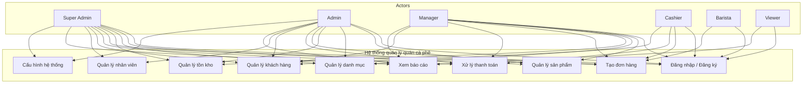
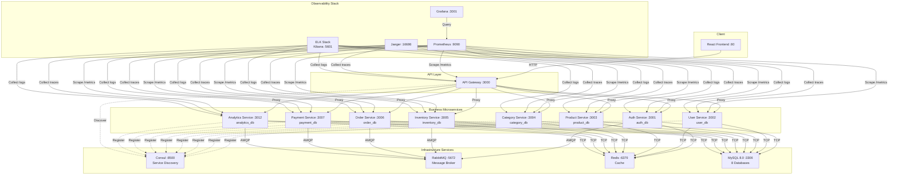
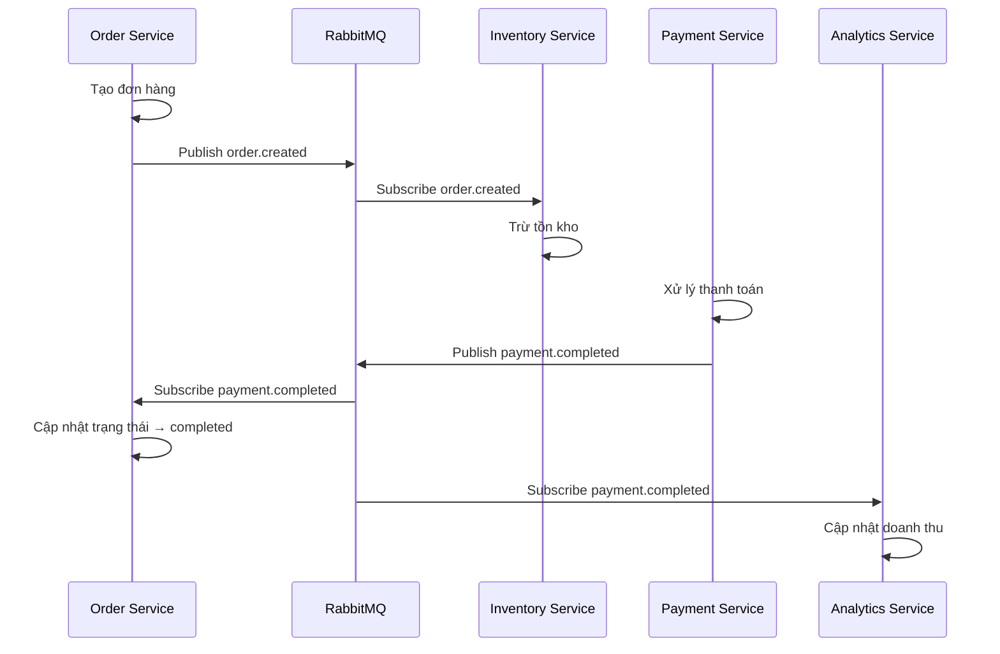
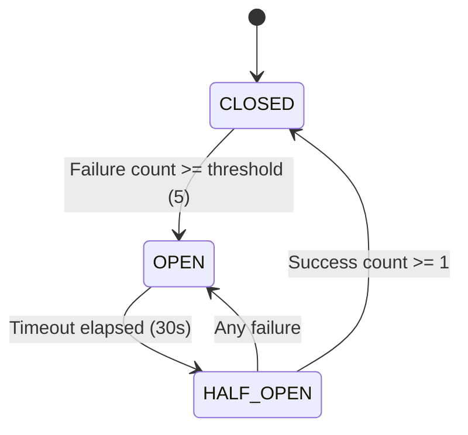
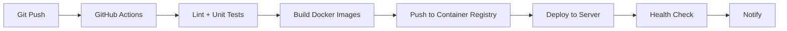

# BÁO CÁO CUỐI KỲ MÔN KIẾN TRÚC HƯỚNG DỊCH VỤ (SOA)

## ĐỀ TÀI: HỆ THỐNG QUẢN LÝ QUÁN CÀ PHÊ

### KIẾN TRÚC MICROSERVICES VỚI DOCKER, RABBITMQ, REDIS

---

**Giảng viên hướng dẫn:** Thầy ...  
**Lớp:** SOA2  
**Nhóm:** X

**TP. Hồ Chí Minh, Tháng 06/2026**

---

## DANH SÁCH THÀNH VIÊN NHÓM

| STT      | Họ và Tên       | MSSV       | Công việc đảm nhiệm                                                                                     | Tỷ lệ đóng góp |
| -------- | --------------- | ---------- | ------------------------------------------------------------------------------------------------------- | -------------- |
| 1        | Đào Văn Phong   | B22DVCN449 | Kiến trúc hệ thống, API Gateway, Docker Compose, Frontend React, User Service, Product Service, báo cáo | 40%            |
| 2        | Nguyễn Anh Tuấn | ...        | Auth Service, Analytics Service, bảo mật JWT & RBAC, Monitoring (Prometheus, Grafana, ELK, Jaeger)      | 20%            |
| 3        | Phùng Quốc Hùng | ...        | Order Service, Payment Service, Saga Orchestrator, RabbitMQ                                             | 20%            |
| 4        | Phạm Văn Hảo    | ...        | Inventory Service, Category Service                                                                     | 20%            |
| **Tổng** |                 |            |                                                                                                         | **100%**       |

_(Sinh viên tự điền MSSV còn thiếu và điều chỉnh phân công, tỷ lệ % theo thực tế)_

---

## MỤC LỤC

1. [CHƯƠNG 1: GIỚI THIỆU ĐỀ TÀI](#chương-1-giới-thiệu-đề-tài)
   - 1.1. Bối cảnh và lý do chọn đề tài
   - 1.2. Mục tiêu của hệ thống
   - 1.3. Phạm vi và giới hạn
   - 1.4. Đối tượng sử dụng
2. [CHƯƠNG 2: CƠ SỞ LÝ THUYẾT](#chương-2-cơ-sở-lý-thuyết)
   - 2.1. Kiến trúc hướng dịch vụ (SOA)
   - 2.2. Kiến trúc Microservices
   - 2.3. So sánh SOA và Microservices
   - 2.4. Các công nghệ sử dụng
3. [CHƯƠNG 3: PHÂN TÍCH HỆ THỐNG](#chương-3-phân-tích-hệ-thống)
   - 3.1. Yêu cầu chức năng
   - 3.2. Yêu cầu phi chức năng
   - 3.3. Phân tích nghiệp vụ
   - 3.4. Use Case Diagram
4. [CHƯƠNG 4: THIẾT KẾ KIẾN TRÚC](#chương-4-thiết-kế-kiến-trúc)
   - 4.1. Kiến trúc tổng thể
   - 4.2. API Gateway
   - 4.3. Các Microservice
   - 4.4. Cơ sở dữ liệu
   - 4.5. Message Queue (RabbitMQ)
   - 4.6. Caching (Redis)
   - 4.7. Service Discovery (Consul)
   - 4.8. Bảo mật (JWT + RBAC)
   - 4.9. Circuit Breaker
   - 4.10. Saga Pattern
5. [CHƯƠNG 5: TRIỂN KHAI VÀ DEMO](#chương-5-triển-khai-và-demo)
   - 5.1. Môi trường triển khai
   - 5.2. Docker Compose
   - 5.3. CI/CD Pipeline
   - 5.4. Monitoring & Observability
   - 5.5. Kết quả demo
6. [CHƯƠNG 6: KIỂM THỬ](#chương-6-kiểm-thử)
   - 6.1. Unit Testing
   - 6.2. Integration Testing
   - 6.3. Performance Testing
7. [CHƯƠNG 7: KẾT LUẬN VÀ HƯỚNG PHÁT TRIỂN](#chương-7-kết-luận-và-hướng-phát-triển)
   - 7.1. Kết quả đạt được
   - 7.2. Hạn chế
   - 7.3. Hướng phát triển
8. [TÀI LIỆU THAM KHẢO](#tài-liệu-tham-khảo)

---

## CHƯƠNG 1: GIỚI THIỆU ĐỀ TÀI

### 1.1. Bối cảnh và lý do chọn đề tài

Trong bối cảnh chuyển đổi số hiện nay, các doanh nghiệp vừa và nhỏ tại Việt Nam, đặc biệt là các chuỗi quán cà phê, đang có nhu cầu ứng dụng công nghệ thông tin vào quản lý hoạt động kinh doanh. Một hệ thống quản lý tích hợp giúp chủ quán theo dõi doanh thu, quản lý tồn kho, xử lý đơn hàng và thanh toán một cách hiệu quả.

Các hệ thống quản lý quán cà phê hiện có trên thị trường thường được xây dựng theo kiến trúc monolithic (nguyên khối), gây khó khăn trong việc mở rộng, bảo trì và nâng cấp. Xu hướng hiện đại là chuyển sang kiến trúc microservices – một phong cách kiến trúc phân tán, trong đó mỗi service đảm nhiệm một chức năng nghiệp vụ riêng biệt, giao tiếp với nhau qua các giao thức nhẹ như HTTP/REST hoặc message queue.

Nhóm chúng tôi chọn đề tài "Hệ thống quản lý quán cà phê theo kiến trúc Microservices" nhằm:

- Áp dụng kiến thức về Kiến trúc hướng dịch vụ (SOA) vào một bài toán thực tế.
- Xây dựng một hệ thống có tính mở rộng cao (scalable), dễ bảo trì (maintainable), có khả năng chịu lỗi (fault-tolerant).
- Tìm hiểu và triển khai các công nghệ hiện đại: Docker, RabbitMQ, Redis, Consul, Prometheus, Grafana, ELK Stack, Jaeger.

### 1.2. Mục tiêu của hệ thống

Hệ thống được xây dựng nhằm đáp ứng các mục tiêu sau:

| Mục tiêu                        | Mô tả                                                                               |
| ------------------------------- | ----------------------------------------------------------------------------------- |
| **Quản lý sản phẩm & danh mục** | CRUD sản phẩm cà phê, phân loại theo danh mục (cà phê, trà, sinh tố...)             |
| **Quản lý đơn hàng**            | Tạo đơn, cập nhật trạng thái, theo dõi lịch sử đơn hàng (dine-in/takeaway/delivery) |
| **Quản lý thanh toán**          | Xử lý thanh toán đa phương thức (tiền mặt, thẻ, ví điện tử, chuyển khoản)           |
| **Quản lý tồn kho**             | Theo dõi số lượng nguyên liệu, cảnh báo tồn kho thấp, lịch sử nhập/xuất kho         |
| **Quản lý khách hàng**          | Lưu trữ thông tin khách hàng, phân hạng (new/regular/vip), điểm tích lũy            |
| **Quản lý nhân viên**           | Hồ sơ nhân viên, chấm công, phân quyền theo vai trò                                 |
| **Phân tích báo cáo**           | Dashboard doanh thu, sản phẩm bán chạy, thống kê theo giờ/ngày/tháng                |
| **Xác thực & phân quyền**       | JWT Authentication, Role-Based Access Control (6 vai trò)                           |
| **Bảo mật**                     | Mã hóa dữ liệu nhạy cảm (AES-256-GCM), audit log, rate limiting                     |
| **Monitoring**                  | Prometheus metrics, Grafana dashboards, ELK logging, Jaeger distributed tracing     |
| **Khả năng mở rộng**            | Kiến trúc microservices cho phép scale độc lập từng service                         |

### 1.3. Phạm vi và giới hạn

**Phạm vi:**

- Hệ thống backend hoàn chỉnh với 8 microservices + 1 API Gateway.
- Frontend React SPA (Single Page Application) với đầy đủ các trang quản lý.
- Triển khai containerized với Docker Compose.
- Tích hợp đầy đủ hệ thống monitoring.

**Giới hạn:**

- Chưa triển khai trên Kubernetes (mới dừng ở Docker Compose).
- Chưa tích hợp cổng thanh toán thực tế (VNPay, Momo).
- Chưa có mobile app.
- Chưa có cơ chế CI/CD tự động hoàn chỉnh.
- Dữ liệu seed còn hạn chế, chưa có dữ liệu lớn để kiểm tra hiệu năng thực tế.

### 1.4. Đối tượng sử dụng

Hệ thống phục vụ 6 nhóm người dùng chính với các quyền hạn khác nhau:

| Vai trò         | ID  | Mô tả               | Quyền hạn chính                                          |
| --------------- | --- | ------------------- | -------------------------------------------------------- |
| **Super Admin** | 1   | Toàn quyền hệ thống | Tất cả chức năng, quản lý nhân viên, cài đặt hệ thống    |
| **Admin**       | 2   | Quản trị viên       | Quản lý sản phẩm, danh mục, đơn hàng, nhân viên, báo cáo |
| **Manager**     | 3   | Quản lý cửa hàng    | Xem báo cáo, quản lý sản phẩm, tồn kho, đơn hàng         |
| **Cashier**     | 4   | Thu ngân            | Tạo đơn hàng, xử lý thanh toán, quản lý khách hàng       |
| **Barista**     | 5   | Pha chế             | Xem đơn hàng đang chờ, cập nhật trạng thái pha chế       |
| **Viewer**      | 6   | Chỉ xem             | Chỉ được phép xem, không có quyền chỉnh sửa              |

---

## CHƯƠNG 2: CƠ SỞ LÝ THUYẾT

### 2.1. Kiến trúc hướng dịch vụ (SOA)

**Định nghĩa:** Service-Oriented Architecture (SOA) là một phong cách kiến trúc phần mềm, trong đó các thành phần của hệ thống được tổ chức thành các dịch vụ (services) độc lập, giao tiếp với nhau qua các giao thức chuẩn hóa (thường là SOAP/HTTP hoặc REST/HTTP).

**Đặc điểm chính của SOA:**

- **Loose Coupling (Liên kết lỏng):** Các service độc lập với nhau, thay đổi một service không ảnh hưởng đến service khác.
- **Reusability (Tái sử dụng):** Service được thiết kế để có thể tái sử dụng trong nhiều ngữ cảnh khác nhau.
- **Interoperability (Tương tác):** Service giao tiếp qua giao thức chuẩn, không phụ thuộc vào ngôn ngữ lập trình hay nền tảng.
- **Discoverability (Khả năng khám phá):** Service được đăng ký vào registry để các service khác có thể tìm thấy.
- **Composability (Khả năng kết hợp):** Các service có thể được kết hợp để tạo thành các quy trình nghiệp vụ phức tạp hơn.

### 2.2. Kiến trúc Microservices

Microservices là một biến thể hiện đại của SOA, tập trung vào việc phân tách ứng dụng thành các service nhỏ, độc lập, mỗi service chạy trong tiến trình riêng và giao tiếp qua cơ chế nhẹ (thường là HTTP/REST hoặc message queue).

**Đặc điểm chính của Microservices:**

- **Single Responsibility:** Mỗi service chỉ đảm nhiệm một chức năng nghiệp vụ duy nhất.
- **Database per Service:** Mỗi service có database riêng, tránh shared database.
- **Decentralized Governance:** Mỗi team có thể chọn công nghệ phù hợp cho service của mình.
- **Independent Deployment:** Có thể deploy từng service độc lập mà không ảnh hưởng đến toàn hệ thống.
- **Fault Isolation (Cách ly lỗi):** Lỗi ở một service không làm sập toàn bộ hệ thống.
- **Observability:** Cần có hệ thống monitoring, logging, tracing tập trung.

**Các Design Pattern trong Microservices:**

- **API Gateway Pattern:** Cổng vào duy nhất cho client, xử lý routing, authentication, rate limiting.
- **Database per Service Pattern:** Mỗi microservice sở hữu database riêng.
- **Saga Pattern:** Quản lý distributed transaction qua chuỗi các local transaction + compensating transaction.
- **Circuit Breaker Pattern:** Ngăn chặn lỗi lan truyền khi một service gặp sự cố.
- **Event-Driven Architecture:** Service giao tiếp bất đồng bộ qua message queue.
- **CQRS (Command Query Responsibility Segregation):** Tách biệt read model và write model.
- **Service Discovery Pattern:** Tự động phát hiện vị trí của các service.

### 2.3. So sánh SOA và Microservices

| Tiêu chí           | SOA truyền thống                        | Microservices                  |
| ------------------ | --------------------------------------- | ------------------------------ |
| Phạm vi service    | Doanh nghiệp (enterprise-wide)          | Ứng dụng (application-wide)    |
| Giao tiếp          | SOAP, XML, ESB (Enterprise Service Bus) | REST/HTTP, gRPC, Message Queue |
| Dữ liệu            | Shared database                         | Database per service           |
| Kích thước service | Lớn, nhiều chức năng                    | Nhỏ, single responsibility     |
| Triển khai         | Monolithic deployment                   | Independent deployment         |
| Công nghệ          | Đồng nhất trong tổ chức                 | Đa dạng, polyglot              |
| Khả năng mở rộng   | Scale cả khối                           | Scale từng service             |

### 2.4. Các công nghệ sử dụng

Trong dự án này, nhóm sử dụng các công nghệ sau:

| Công nghệ         | Phiên bản | Vai trò                                                   |
| ----------------- | --------- | --------------------------------------------------------- |
| **Node.js**       | 18+       | Runtime cho tất cả microservices                          |
| **Express.js**    | 4.18      | Web framework cho REST API                                |
| **MySQL**         | 8.0       | Hệ quản trị cơ sở dữ liệu quan hệ                         |
| **Redis**         | 7.x       | Distributed caching                                       |
| **RabbitMQ**      | 3.12      | Message broker (Topic Exchange)                           |
| **Docker**        | Latest    | Containerization                                          |
| **React + Vite**  | 18+       | Frontend framework                                        |
| **Tailwind CSS**  | 3.x       | CSS framework cho giao diện                               |
| **JWT**           | 9.x       | JSON Web Token cho xác thực                               |
| **Prometheus**    | Latest    | Metrics collection                                        |
| **Grafana**       | Latest    | Dashboard & visualization                                 |
| **Jaeger**        | Latest    | Distributed tracing                                       |
| **ELK Stack**     | 8.x       | Elasticsearch + Logstash + Kibana cho centralized logging |
| **Consul**        | Latest    | Service discovery                                         |
| **Winston**       | 3.x       | Logging library                                           |
| **OpenTelemetry** | Latest    | Tracing instrumentation                                   |
| **Jest**          | Latest    | Unit & integration testing                                |
| **Helmet**        | 7.x       | HTTP security headers                                     |
| **bcrypt**        | Latest    | Password hashing                                          |
| **AES-256-GCM**   | Native    | Data encryption                                           |

**Lý do lựa chọn công nghệ:**

1. **Node.js/Express.js:** Được chọn vì tính phi đồng bộ (non-blocking I/O), hiệu năng cao cho các tác vụ I/O intensive như API gateway, và hệ sinh thái npm phong phú.

2. **MySQL 8.0:** Phù hợp với dữ liệu có cấu trúc rõ ràng (sản phẩm, đơn hàng, thanh toán), hỗ trợ transaction ACID, và nhóm đã có kinh nghiệm làm việc với MySQL.

3. **Redis 7:** Làm cache phân tán giúp giảm tải database, hỗ trợ các cấu trúc dữ liệu phong phú, và có cơ chế LRU eviction policy.

4. **RabbitMQ:** Message broker tin cậy, hỗ trợ Topic Exchange phù hợp với mô hình event-driven, đảm bảo message không bị mất (persistent messages, acknowledgment).

5. **Docker:** Đảm bảo tính nhất quán giữa môi trường development và production, dễ dàng scale service.

6. **JWT + RBAC:** JWT cho phép stateless authentication, phù hợp với kiến trúc microservices. RBAC giúp quản lý quyền truy cập chi tiết theo từng vai trò.

---

## CHƯƠNG 3: PHÂN TÍCH HỆ THỐNG

### 3.1. Yêu cầu chức năng

Hệ thống được phân tích thành các nhóm chức năng chính sau:

#### A. Quản lý xác thực & phân quyền (Auth Service)

- **FR-01:** Đăng nhập bằng email và mật khẩu, trả về JWT access token + refresh token.
- **FR-02:** Đăng ký tài khoản mới.
- **FR-03:** Làm mới access token bằng refresh token.
- **FR-04:** Quên mật khẩu – gửi email reset.
- **FR-05:** Phân quyền theo 6 vai trò: Super Admin, Admin, Manager, Cashier, Barista, Viewer.
- **FR-06:** Tự động seed tài khoản admin mặc định khi khởi tạo hệ thống.
- **FR-07:** Ghi audit log mọi hành động quan trọng.

#### B. Quản lý người dùng (User Service)

- **FR-08:** CRUD khách hàng (customers) với đầy đủ thông tin cá nhân.
- **FR-09:** Phân hạng khách hàng tự động (new/regular/vip) dựa trên tổng chi tiêu.
- **FR-10:** Tích điểm loyalty cho khách hàng.
- **FR-11:** Quản lý hồ sơ nhân viên (employees): thông tin cá nhân, lương, ngân hàng.
- **FR-12:** Upload ảnh đại diện (avatar).
- **FR-13:** Cấu hình cài đặt hệ thống (tên quán, địa chỉ, thuế suất, giờ mở cửa...).

#### C. Quản lý sản phẩm (Product Service)

- **FR-14:** CRUD sản phẩm với thông tin: tên, SKU, giá bán, giá vốn, mô tả, ảnh.
- **FR-15:** Phân loại sản phẩm theo danh mục.
- **FR-16:** Tìm kiếm sản phẩm theo tên, SKU, danh mục.
- **FR-17:** Thống kê sản phẩm bán chạy.

#### D. Quản lý danh mục (Category Service)

- **FR-18:** CRUD danh mục sản phẩm với slug và màu sắc đại diện.
- **FR-19:** Hỗ trợ danh mục cha-con (phân cấp).

#### E. Quản lý tồn kho (Inventory Service)

- **FR-20:** Theo dõi số lượng tồn kho từng sản phẩm: tồn thực tế, đã đặt trước, khả dụng.
- **FR-21:** Nhập kho (import stock) – cập nhật số lượng và ghi transaction.
- **FR-22:** Xuất kho (export/adjustment) – điều chỉnh tồn kho thủ công.
- **FR-23:** Cảnh báo tồn kho thấp (low stock alert) dựa trên reorder point.
- **FR-24:** Lịch sử giao dịch kho (inventory transactions).
- **FR-25:** Tự động trừ kho khi có đơn hàng mới (lắng nghe event ORDER_CREATED từ RabbitMQ).

#### F. Quản lý đơn hàng (Order Service)

- **FR-26:** Tạo đơn hàng mới với danh sách sản phẩm, số lượng, ghi chú.
- **FR-27:** Hỗ trợ 3 loại đơn: dine_in (tại chỗ), takeaway (mang đi), delivery (giao hàng).
- **FR-28:** Luồng trạng thái đơn hàng: pending → processing → completed / cancelled / refunded.
- **FR-29:** Xem chi tiết đơn hàng, lịch sử đơn hàng.
- **FR-30:** Hủy đơn hàng (có lý do).
- **FR-31:** Tự động cập nhật trạng thái đơn khi thanh toán hoàn tất (lắng nghe event PAYMENT_COMPLETED).

#### G. Quản lý thanh toán (Payment Service)

- **FR-32:** Tạo giao dịch thanh toán cho đơn hàng.
- **FR-33:** Hỗ trợ 4 phương thức: cash (tiền mặt), card (thẻ), e_wallet (ví điện tử), bank_transfer (chuyển khoản).
- **FR-34:** Với thanh toán tiền mặt: tính tiền thừa (change_amount).
- **FR-35:** Hoàn tiền (refund) toàn phần hoặc một phần.
- **FR-36:** Lịch sử thanh toán, lọc theo trạng thái và phương thức.

#### H. Phân tích & báo cáo (Analytics Service)

- **FR-37:** Dashboard tổng quan: doanh thu hôm nay, số đơn hàng, giá trị đơn trung bình.
- **FR-38:** Báo cáo doanh thu theo ngày (daily revenue).
- **FR-39:** Top sản phẩm bán chạy.
- **FR-40:** Phân tích lưu lượng theo giờ (hourly traffic).
- **FR-41:** Thống kê phương thức thanh toán.
- **FR-42:** Real-time analytics: lắng nghe sự kiện từ RabbitMQ để cập nhật Redis cache.

### 3.2. Yêu cầu phi chức năng

| Mã         | Yêu cầu          | Mô tả                                                                                                               |
| ---------- | ---------------- | ------------------------------------------------------------------------------------------------------------------- |
| **NFR-01** | Performance      | API response time < 200ms cho 95% request; hỗ trợ 1000 concurrent users                                             |
| **NFR-02** | Scalability      | Mỗi service có thể scale độc lập theo chiều ngang                                                                   |
| **NFR-03** | Reliability      | Hệ thống đạt 99.9% uptime; tự động phục hồi khi service fail                                                        |
| **NFR-04** | Security         | JWT authentication, RBAC authorization, mã hóa dữ liệu nhạy cảm AES-256-GCM, Helmet security headers, Rate Limiting |
| **NFR-05** | Observability    | Centralized logging (ELK), metrics (Prometheus), tracing (Jaeger), dashboards (Grafana)                             |
| **NFR-06** | Maintainability  | Code tổ chức theo module rõ ràng, shared library dùng chung, Docker cho môi trường nhất quán                        |
| **NFR-07** | Fault Tolerance  | Circuit Breaker ngăn cascade failure, Retry mechanism, Graceful degradation                                         |
| **NFR-08** | Data Consistency | Eventual consistency qua RabbitMQ events; Saga pattern cho distributed transaction                                  |

### 3.3. Phân tích nghiệp vụ

#### Quy trình đặt hàng tại quán (Dine-in):

```
Khách vào quán → Chọn bàn → Cashier tạo đơn (chọn sản phẩm, số lượng)
→ Hệ thống kiểm tra tồn kho → Tạo đơn hàng (status: pending)
→ Barista nhận đơn → Pha chế → Cập nhật trạng thái (processing)
→ Khách dùng xong → Cashier xử lý thanh toán
→ Payment completed → Inventory tự động trừ kho → Order tự động chuyển completed
→ Analytics cập nhật doanh thu real-time
```

#### Quy trình xử lý phân tán (Saga Pattern):

```
┌──────────────┐    ┌──────────────┐    ┌──────────────┐
│ 1. Tạo Order │ →  │ 2. Trừ tồn   │ →  │ 3. Thanh toán│
│  (order-svc) │    │  (inventory) │    │  (payment)   │
└──────────────┘    └──────────────┘    └──────────────┘
       ↓ FAIL              ↓ FAIL             ↓ FAIL
  [Cancel Order]     [Hoàn tồn kho]     [Hoàn tiền]
  Compensating       Compensating       Compensating
```

### 3.4. Use Case Diagram



---

## CHƯƠNG 4: THIẾT KẾ KIẾN TRÚC

### 4.1. Kiến trúc tổng thể

Hệ thống được thiết kế theo kiến trúc Microservices với các thành phần chính:



**Nguyên tắc thiết kế chính:**

1. **Database per Service:** Mỗi microservice sở hữu database MySQL riêng biệt, đảm bảo tính độc lập về dữ liệu. Không service nào được phép truy cập trực tiếp database của service khác.

2. **API Gateway Pattern:** API Gateway (port 3000) là điểm vào duy nhất cho frontend. Gateway xử lý: routing, authentication, rate limiting, RBAC, correlation ID, logging, Swagger docs.

3. **Event-Driven Communication:** Các service giao tiếp bất đồng bộ qua RabbitMQ Topic Exchange `coffee_events`. Các sự kiện chính: `order.created`, `payment.completed`, `inventory.stock.low`, `user.registered`.

4. **Synchronous Communication:** Frontend → API Gateway → Microservice qua HTTP/REST proxy. Mỗi request được gắn `X-Correlation-Id` để trace xuyên suốt các service.

5. **Service Discovery:** Consul được sử dụng làm service registry. Mỗi service tự đăng ký với Consul khi khởi động. API Gateway sử dụng Consul để dynamic routing (với fallback về Docker DNS).

6. **Circuit Breaker:** Mỗi service route trong API Gateway được bảo vệ bởi Circuit Breaker riêng, ngăn chặn lỗi lan truyền.

### 4.2. API Gateway

API Gateway là thành phần trung tâm, đóng vai trò:

```
                    ┌─────────────────────────────────┐
                    │         API GATEWAY :3000        │
                    │                                  │
  Client Request ──▶│ 1. Helmet (Security Headers)     │
                    │ 2. CORS                          │
                    │ 3. Correlation ID                │
                    │ 4. Prometheus Metrics             │
                    │ 5. JSON Body Parser (selective)   │
                    │ 6. Request Logger (Morgan/Winston)│
                    │ 7. Rate Limiter (200 req/phút)     │──▶ Microservice
                    │ 8. JWT Auth (verify token)        │
                    │ 9. RBAC (role check)              │
                    │ 10. Proxy to target service       │
                    │ 11. Swagger UI (/api/docs)        │
                    │ 12. Health Check (/health)        │
                    │ 13. Prometheus (/metrics)         │
                    └─────────────────────────────────┘
```

**Cấu hình proxy routes:**

| Client Path            | Target Service           | Backend Path Rewrite             |
| ---------------------- | ------------------------ | -------------------------------- |
| `/api/v1/auth/*`       | `auth-service:3001`      | `/api/v1/auth/*` → `/api/auth/*` |
| `/api/v1/users/*`      | `user-service:3002`      | Tương tự                         |
| `/api/v1/products/*`   | `product-service:3003`   | Tương tự                         |
| `/api/v1/categories/*` | `category-service:3004`  | Tương tự                         |
| `/api/v1/inventory/*`  | `inventory-service:3005` | Tương tự                         |
| `/api/v1/orders/*`     | `order-service:3006`     | Tương tự                         |
| `/api/v1/payments/*`   | `payment-service:3007`   | Tương tự                         |
| `/api/v1/analytics/*`  | `analytics-service:3012` | Tương tự                         |
| `/api/v1/employees/*`  | `user-service:3002`      | Tương tự                         |
| `/api/v1/settings/*`   | `user-service:3002`      | Tương tự                         |

Gateway cũng tự động forward các header: `X-User-Id`, `X-User-Role`, `X-Correlation-Id` từ JWT token sang microservice backend.

**Middleware Pipeline chi tiết:**

```javascript
// 1. Bảo mật HTTP headers
app.use(helmet({ contentSecurityPolicy: false }));

// 2. Cross-Origin Resource Sharing
app.use(cors());

// 3. Correlation ID cho distributed tracing
app.use(correlationId);

// 4. Prometheus metrics
app.use(metricsMiddleware("api-gateway"));

// 5. Body parser (có chọn lọc - skip proxy routes)
app.use((req, res, next) => {
  if (req.path.startsWith("/api")) return next();
  express.json({ limit: "10mb" })(req, res, next);
});

// 6. Request logging
app.use(requestLogger);

// 7. Rate limiting: 200 req/phút cho API routes
app.use((req, res, next) => {
  if (isApiPath(req.path)) {
    return rateLimit({ windowMs: 60000, max: 200 })(req, res, next);
  }
  next();
});

// 8. JWT Authentication
app.use((req, res, next) => {
  if (req.path.startsWith("/api")) {
    return authMiddleware(req, res, next);
  }
  next();
});

// 9. RBAC Authorization
applyRbac(app);

// 10. Proxy routes
registerProxies(app);

// 11. 404 handler
app.use((req, res) =>
  res.status(404).json({
    success: false,
    message: "Route not found",
  }),
);

// 12. Global error handler
app.use(errorHandler);
```

### 4.3. Các Microservice

#### 4.3.1. Auth Service (Port 3001)

**Trách nhiệm:** Xác thực người dùng, quản lý token, phân quyền.

**Cơ sở dữ liệu:** `auth_db`

- `roles`: Bảng vai trò (6 roles)
- `users`: Thông tin đăng nhập (email, password_hash, role_id)
- `refresh_tokens`: Quản lý refresh token
- `audit_logs`: Nhật ký hành động (toàn hệ thống)

**API Endpoints:**
| Method | Endpoint | Mô tả |
|--------|----------|-------|
| POST | `/api/auth/login` | Đăng nhập → JWT + refresh token |
| POST | `/api/auth/register` | Đăng ký tài khoản mới |
| POST | `/api/auth/refresh` | Làm mới access token |
| POST | `/api/auth/forgot-password` | Quên mật khẩu |
| GET | `/health` | Health check |

**Đặc điểm kỹ thuật:**

- Mật khẩu được hash bằng bcrypt với số vòng cấu hình được.
- JWT access token có thời hạn ngắn (mặc định 15 phút), refresh token có thời hạn dài hơn (7 ngày).
- Tự động seed tài khoản admin (email: `phong@triennguyen.com`, role: super_admin) khi khởi động lần đầu.
- Kết nối RabbitMQ để publish event `user.registered` khi có user mới.

#### 4.3.2. User Service (Port 3002)

**Trách nhiệm:** Quản lý khách hàng, nhân viên, cấu hình hệ thống.

**Cơ sở dữ liệu:** `user_db`

- `customers`: Thông tin khách hàng (phân hạng, điểm tích lũy)
- `employees`: Thông tin nhân viên (lương, ngân hàng, liên hệ khẩn cấp)
- `settings`: Cấu hình hệ thống (key-value)

**API Endpoints:**
| Method | Endpoint | Mô tả |
|--------|----------|-------|
| GET/POST | `/api/users` | Danh sách / Tạo khách hàng |
| GET/PUT/DELETE | `/api/users/:id` | Chi tiết / Sửa / Xóa khách hàng |
| GET/POST | `/api/employees` | Danh sách / Tạo nhân viên |
| GET/PUT/DELETE | `/api/employees/:id` | Chi tiết / Sửa / Xóa nhân viên |
| GET/PUT | `/api/settings` | Xem / Sửa cấu hình |
| POST | `/api/upload` | Upload ảnh |
| GET | `/api/uploads/:filename` | Xem ảnh đã upload |

#### 4.3.3. Product Service (Port 3003)

**Trách nhiệm:** CRUD sản phẩm, tìm kiếm.

**Cơ sở dữ liệu:** `product_db`

**Seed data:** 12 sản phẩm mẫu (Cà phê sữa đá, Bạc xỉu, Cappuccino, Trà đào cam sả, Sinh tố bơ, Bánh Tiramisu, Đá xay Socola, Kem Matcha...)

**API Endpoints:**
| Method | Endpoint | Mô tả |
|--------|----------|-------|
| GET | `/api/products` | Danh sách sản phẩm (hỗ trợ filter, search, pagination) |
| GET | `/api/products/:id` | Chi tiết sản phẩm |
| POST | `/api/products` | Tạo sản phẩm mới |
| PUT | `/api/products/:id` | Cập nhật sản phẩm |
| DELETE | `/api/products/:id` | Xóa mềm sản phẩm |

#### 4.3.4. Category Service (Port 3004)

**Trách nhiệm:** Quản lý danh mục sản phẩm.

**Cơ sở dữ liệu:** `category_db`

**Seed data:** 5 danh mục (Cà Phê Việt, Trà & Trà Sữa, Sinh Tố & Nước Ép, Bánh & Ăn Nhẹ, Đá Xay & Kem)

**API Endpoints:** CRUD danh mục, hỗ trợ danh mục cha-con.

#### 4.3.5. Inventory Service (Port 3005)

**Trách nhiệm:** Quản lý tồn kho, giao dịch nhập/xuất.

**Cơ sở dữ liệu:** `inventory_db`

- `inventory`: Số lượng tồn, đặt trước, khả dụng (computed column), ngưỡng cảnh báo
- `inventory_transactions`: Lịch sử nhập/xuất kho

**Event Subscriptions:**

- Lắng nghe `order.created` → Tự động trừ kho (quantity_in_stock giảm, quantity_reserved tăng)

**API Endpoints:**
| Method | Endpoint | Mô tả |
|--------|----------|-------|
| GET | `/api/inventory` | Danh sách tồn kho |
| GET | `/api/inventory/alerts` | Sản phẩm tồn kho thấp |
| POST | `/api/inventory/import` | Nhập kho |
| POST | `/api/inventory/export` | Xuất kho |
| GET | `/api/inventory/transactions` | Lịch sử giao dịch |
| GET | `/api/inventory/:productId` | Chi tiết tồn kho 1 sản phẩm |

#### 4.3.6. Order Service (Port 3006)

**Trách nhiệm:** Tạo và quản lý đơn hàng.

**Cơ sở dữ liệu:** `order_db`

- `orders`: Thông tin đơn hàng (loại, trạng thái, số tiền, bàn)
- `order_items`: Chi tiết sản phẩm trong đơn

**Event Publishing:**

- `order.created`: Khi đơn hàng được tạo (inventory service lắng nghe để trừ kho)

**Event Subscriptions:**

- Lắng nghe `payment.completed` → Tự động cập nhật trạng thái đơn thành "completed"

**API Endpoints:**
| Method | Endpoint | Mô tả |
|--------|----------|-------|
| GET/POST | `/api/orders` | Danh sách / Tạo đơn hàng |
| GET | `/api/orders/:id` | Chi tiết đơn hàng |
| PUT | `/api/orders/:id/status` | Cập nhật trạng thái |
| POST | `/api/orders/:id/cancel` | Hủy đơn hàng |

#### 4.3.7. Payment Service (Port 3007)

**Trách nhiệm:** Xử lý thanh toán đơn hàng.

**Cơ sở dữ liệu:** `payment_db`

**Event Publishing:**

- `payment.completed`: Khi thanh toán thành công (order service và analytics service lắng nghe)
- `payment.refunded`: Khi hoàn tiền

**API Endpoints:**
| Method | Endpoint | Mô tả |
|--------|----------|-------|
| GET/POST | `/api/payments` | Danh sách / Tạo thanh toán |
| GET | `/api/payments/:id` | Chi tiết thanh toán |
| POST | `/api/payments/:id/refund` | Hoàn tiền |

#### 4.3.8. Analytics Service (Port 3012)

**Trách nhiệm:** Phân tích dữ liệu kinh doanh.

**Cơ sở dữ liệu:** `analytics_db`

- `daily_sales`: Tổng hợp doanh thu theo ngày
- `top_products`: Sản phẩm bán chạy
- `hourly_traffic`: Lưu lượng theo giờ

**Event Subscriptions:**

- `order.created` → Cập nhật real-time order count trong Redis
- `order.completed` → Cập nhật real-time revenue trong Redis
- `payment.completed` → Cập nhật payment stats

**API Endpoints:**
| Method | Endpoint | Mô tả |
|--------|----------|-------|
| GET | `/api/analytics/dashboard` | Dashboard tổng quan |
| GET | `/api/analytics/revenue` | Báo cáo doanh thu |
| GET | `/api/analytics/top-products` | Top sản phẩm bán chạy |
| GET | `/api/analytics/hourly-traffic` | Lưu lượng theo giờ |

### 4.4. Cơ sở dữ liệu

#### Chiến lược Database per Service

Mỗi microservice sở hữu database MySQL riêng biệt. Các database được tạo tự động thông qua migration scripts khi Docker container MySQL khởi động.

```
┌─────────────┐  ┌──────────┐  ┌───────────┐  ┌───────────┐
│   auth_db   │  │ user_db  │  │product_db │  │category_db│
│             │  │          │  │           │  │           │
│ • roles     │  │•customers│  │ •products │  │•categories│
│ • users     │  │•employees│  │           │  │           │
│ • refresh_  │  │•settings │  │           │  │           │
│   tokens    │  │          │  │           │  │           │
│ • audit_logs│  │          │  │           │  │           │
└─────────────┘  └──────────┘  └───────────┘  └───────────┘

┌─────────────┐  ┌──────────┐  ┌───────────┐  ┌───────────┐
│inventory_db │  │ order_db │  │payment_db │  │analytics_db│
│             │  │          │  │           │  │           │
│ •inventory  │  │ •orders  │  │ •payments │  │•daily_sales│
│ •inventory_ │  │ •order_  │  │           │  │•top_products│
│  transactions│ │  items   │  │           │  │•hourly_    │
│             │  │          │  │           │  │ traffic    │
└─────────────┘  └──────────┘  └───────────┘  └───────────┘
```

**Đặc điểm thiết kế database:**

- Sử dụng `utf8mb4` và `utf8mb4_unicode_ci` để hỗ trợ tiếng Việt và emoji.
- Sử dụng UUID (CHAR(36)) làm khóa định danh công khai, INT AUTO_INCREMENT làm khóa chính nội bộ.
- Soft delete với `deleted_at` timestamp cho phép khôi phục dữ liệu.
- Các ràng buộc CHECK constraint để đảm bảo tính toàn vẹn dữ liệu (giá >= 0, số lượng > 0...).
- Computed column `quantity_available = quantity_in_stock - quantity_reserved` trong bảng inventory.
- Unique constraint có điều kiện (email + deleted_at) cho phép tái sử dụng email sau khi xóa.

### 4.5. Message Queue (RabbitMQ)

RabbitMQ đóng vai trò là message broker trung tâm, cho phép các service giao tiếp bất đồng bộ theo mô hình publish/subscribe.

**Cấu hình:**

- **Exchange:** `coffee_events` (type: `topic`, durable: true)
- **Virtual Host:** `coffee_vhost`
- **Message persistence:** `persistent: true` (message không bị mất khi RabbitMQ restart)

**Event Flow:**



**Các sự kiện trong hệ thống:**

| Routing Key                | Publisher         | Subscribers                          | Mô tả                  |
| -------------------------- | ----------------- | ------------------------------------ | ---------------------- |
| `order.created`            | Order Service     | Inventory Service, Analytics Service | Đơn hàng mới được tạo  |
| `payment.completed`        | Payment Service   | Order Service, Analytics Service     | Thanh toán thành công  |
| `payment.refunded`         | Payment Service   | Order Service                        | Hoàn tiền              |
| `order.completed`          | Order Service     | Analytics Service                    | Đơn hàng hoàn thành    |
| `inventory.stock.low`      | Inventory Service | (Alert system)                       | Tồn kho thấp           |
| `inventory.stock.out`      | Inventory Service | (Alert system)                       | Hết hàng               |
| `user.registered`          | Auth Service      | User Service                         | Người dùng mới đăng ký |
| `inventory.stock.imported` | Inventory Service | Product Service                      | Nhập kho               |

### 4.6. Caching (Redis)

Redis được sử dụng làm cache phân tán với các mục đích:

1. **Cache GET response:** Giảm tải database cho các request đọc (sản phẩm, danh mục...).
2. **Real-time analytics counter:** Lưu trữ số liệu thống kê real-time (số đơn hàng, doanh thu hôm nay).
3. **Dashboard cache:** Cache kết quả dashboard để tránh query database liên tục.

**Chiến lược cache:**

- **TTL mặc định:** 60 giây cho API cache.
- **Cache Invalidation:** Xóa cache khi có thay đổi (POST/PUT/DELETE).
- **Eviction Policy:** `allkeys-lru` – tự động xóa key ít dùng nhất khi hết bộ nhớ.
- **Max Memory:** 256MB.
- **Persistence:** AOF (Append Only File) để phục hồi dữ liệu khi restart.

**Middleware cache trong API Gateway:**

```javascript
// Tự động cache GET response dựa trên URL
app.use("/api/v1/products", cacheMiddleware(60)); // Cache 60s
app.use("/api/v1/categories", cacheMiddleware(120)); // Cache 120s
```

### 4.7. Service Discovery (Consul)

Consul được sử dụng để đăng ký và khám phá service động.

**Cơ chế hoạt động:**

1. Mỗi service khi khởi động → tự đăng ký với Consul (PUT `/v1/agent/service/register`)
2. Health check định kỳ 10 giây → Consul kiểm tra `/health` endpoint
3. API Gateway query Consul để lấy địa chỉ service → `GET /v1/health/service/{name}?passing=true`
4. Fallback: nếu Consul không khả dụng → sử dụng Docker DNS (service name → IP nội bộ)

**Caching kết quả discovery:** 30 giây – giảm số lần gọi Consul API.

### 4.8. Bảo mật (JWT + RBAC)

#### JWT Authentication

```
┌──────────┐         ┌──────────┐         ┌──────────┐
│  Client  │         │  Gateway │         │Auth Service│
└────┬─────┘         └────┬─────┘         └────┬─────┘
     │  POST /api/auth/login│                   │
     │──────────────────────▶                   │
     │                     │  Proxy to auth-svc │
     │                     │───────────────────▶│
     │                     │                    │ Verify email+password
     │                     │  {accessToken,     │ Generate JWT
     │                     │   refreshToken}    │
     │                     │◀───────────────────│
     │  {accessToken,      │                    │
     │   refreshToken}     │                    │
     │◀────────────────────│                    │
     │                     │                    │
     │  GET /api/products  │                    │
     │  (Bearer accessToken)│                   │
     │──────────────────────▶                   │
     │                     │ Verify JWT         │
     │                     │ Extract user info  │
     │                     │ Check RBAC         │
     │                     │───────────────────▶│ Proxy to product-svc
     │  200 OK + data      │                    │
     │◀────────────────────│                    │
```

- Access token chứa: `{ id, email, role_id, iat, exp }`
- Token được ký bằng HMAC-SHA256 với secret từ biến môi trường.
- Public paths: `/api/auth/login`, `/api/auth/register`, `/api/auth/refresh`, `/health`, `/api/docs`, `/api/uploads/*`.

#### RBAC (Role-Based Access Control)

6 vai trò với phân cấp quyền:

```
Super Admin (1) ──▶ Admin (2) ──▶ Manager (3)
                                      │
                        ┌─────────────┼─────────────┐
                        │             │             │
                   Cashier (4)   Barista (5)   Viewer (6)
```

**Ma trận quyền:**

| Tài nguyên | Method          | Super Admin | Admin | Manager | Cashier | Barista | Viewer |
| ---------- | --------------- | :---------: | :---: | :-----: | :-----: | :-----: | :----: |
| Products   | GET             |     ✅      |  ✅   |   ✅    |   ✅    |   ✅    |   ✅   |
| Products   | POST/PUT/DELETE |     ✅      |  ✅   |   ✅    |   ❌    |   ❌    |   ❌   |
| Categories | GET             |     ✅      |  ✅   |   ✅    |   ✅    |   ✅    |   ✅   |
| Categories | POST/PUT/DELETE |     ✅      |  ✅   |   ✅    |   ❌    |   ❌    |   ❌   |
| Inventory  | GET             |     ✅      |  ✅   |   ✅    |   ✅    |   ✅    |   ✅   |
| Inventory  | POST/PUT/DELETE |     ✅      |  ✅   |   ✅    |   ❌    |   ❌    |   ❌   |
| Orders     | GET             |     ✅      |  ✅   |   ✅    |   ✅    |   ✅    |   ✅   |
| Orders     | CREATE          |     ✅      |  ✅   |   ✅    |   ✅    |   ❌    |   ❌   |
| Orders     | UPDATE/DELETE   |     ✅      |  ✅   |   ✅    |   ❌    |   ❌    |   ❌   |
| Payments   | GET             |     ✅      |  ✅   |   ✅    |   ✅    |   ❌    |   ✅   |
| Payments   | POST/PUT/DELETE |     ✅      |  ✅   |   ✅    |   ✅    |   ❌    |   ❌   |
| Customers  | GET             |     ✅      |  ✅   |   ❌    |   ✅    |   ❌    |   ❌   |
| Customers  | POST/PUT/DELETE |     ✅      |  ✅   |   ✅    |   ✅    |   ❌    |   ❌   |
| Employees  | GET             |     ✅      |  ✅   |   ✅    |   ❌    |   ❌    |   ✅   |
| Employees  | POST/PUT/DELETE |     ✅      |  ✅   |   ❌    |   ❌    |   ❌    |   ❌   |
| Settings   | GET             |     ✅      |  ✅   |   ✅    |   ❌    |   ❌    |   ❌   |
| Settings   | PUT             |     ✅      |  ✅   |   ❌    |   ❌    |   ❌    |   ❌   |
| Analytics  | ALL             |     ✅      |  ✅   |   ✅    |   ❌    |   ❌    |   ❌   |

### 4.9. Circuit Breaker

Circuit Breaker pattern được triển khai trong API Gateway để bảo vệ hệ thống khi một service backend gặp sự cố.

**Trạng thái Circuit Breaker:**



**Cấu hình mặc định:**

- `failureThreshold`: 5 lỗi liên tiếp
- `resetTimeout`: 30 giây
- `halfOpenMax`: 1 request thử nghiệm

Khi circuit mở (OPEN), API Gateway trả về lỗi 503 "Service Unavailable" ngay lập tức, không gửi request đến service bị lỗi.

### 4.10. Saga Pattern - Distributed Transaction

Saga Orchestrator được triển khai để quản lý giao dịch phân tán qua nhiều service.

**Ví dụ: Saga Tạo Đơn Hàng**

```javascript
const createOrderSaga = new SagaOrchestrator()
  .step(
    'create_order',                          // Step 1: Tạo đơn hàng
    async (ctx) => orderApi.create(ctx.orderData),
    async (ctx) => orderApi.cancel(ctx.orderId)  // Compensate: Hủy đơn
  )
  .step(
    'reserve_inventory',                     // Step 2: Đặt trước tồn kho
    async (ctx) => inventoryApi.reserve(ctx.items),
    async (ctx) => inventoryApi.release(ctx.items) // Compensate: Hoàn tồn
  )
  .step(
    'process_payment',                       // Step 3: Xử lý thanh toán
    async (ctx) => paymentApi.process({...}),
    async (ctx) => paymentApi.refund(ctx.paymentId) // Compensate: Hoàn tiền
  )
  .step(
    'confirm_order',                         // Step 4: Xác nhận đơn
    async (ctx) => orderApi.confirm(ctx.orderId),
    async (ctx) => {} // Không cần compensate ở bước cuối
  );
```

**Nguyên tắc:**

- Nếu tất cả steps thành công → transaction hoàn tất.
- Nếu bất kỳ step nào thất bại → thực thi các compensating action theo thứ tự NGƯỢC lại.
- Compensating action là "undo" logic (hủy đơn, hoàn tồn, hoàn tiền...).
- Saga ID được sinh ra để tracking toàn bộ quá trình.

---

## CHƯƠNG 5: TRIỂN KHAI VÀ DEMO

### 5.1. Môi trường triển khai

Hệ thống được containerized hoàn toàn với Docker:

| Thành phần               | Image                             | Port(s)     |
| ------------------------ | --------------------------------- | ----------- |
| MySQL                    | `mysql:8.0`                       | 3308:3306   |
| Redis                    | `redis:7-alpine`                  | 6379:6379   |
| RabbitMQ                 | `rabbitmq:3.12-management-alpine` | 5672, 15672 |
| API Gateway              | Custom Dockerfile                 | 3000        |
| Auth Service             | Custom Dockerfile                 | 3001        |
| User Service             | Custom Dockerfile                 | 3002        |
| Product Service          | Custom Dockerfile                 | 3003        |
| Category Service         | Custom Dockerfile                 | 3004        |
| Inventory Service        | Custom Dockerfile                 | 3005        |
| Order Service            | Custom Dockerfile                 | 3006        |
| Payment Service          | Custom Dockerfile                 | 3007        |
| Analytics Service        | Custom Dockerfile                 | 3012        |
| Frontend (Nginx + React) | Custom Dockerfile                 | 80          |
| Prometheus               | Prometheus image                  | 9090        |
| Grafana                  | Grafana image                     | 3001        |
| Jaeger                   | Jaeger image                      | 16686       |
| ELK Stack                | Elasticsearch + Kibana            | 5601        |
| Consul                   | Consul image                      | 8500        |

### 5.2. Docker Compose

#### Cấu trúc Dockerfile

Mỗi service có Dockerfile riêng, sử dụng multi-stage build để tối ưu kích thước image:

```dockerfile
FROM node:18-alpine AS builder
WORKDIR /app
COPY package*.json ./
RUN npm ci --only=production

FROM node:18-alpine
WORKDIR /app
COPY --from=builder /app/node_modules ./node_modules
COPY . .
EXPOSE 3000
CMD ["node", "src/index.js"]
```

#### Docker Compose Configuration

File `docker-compose.yml` chính định nghĩa toàn bộ hệ thống:

- **Networks:** `coffee-network` (bridge, subnet 172.20.0.0/16)
- **Volumes:** 8 persistent volumes cho dữ liệu
- **Health Checks:** Tất cả service đều có health check:
  - MySQL: `mysqladmin ping`
  - Redis: `redis-cli ping`
  - RabbitMQ: `rabbitmq-diagnostics ping`
  - Các Node service: `/health` endpoint được Consul kiểm tra
- **Depends On:** Service chỉ khởi động khi dependencies đã healthy (MySQL, Redis, RabbitMQ)
- **Environment Variables:** Tất cả cấu hình qua biến môi trường (`.env` file)

#### Development Mode

File `docker-compose.dev.yml` cho phép hot-reload trong quá trình phát triển:

- Volume mount source code vào container
- Sử dụng `node --watch` (Node 18+) để tự động restart khi code thay đổi
- Không cần rebuild Docker image mỗi lần sửa code

### 5.3. CI/CD Pipeline (Dự kiến)



Pipeline dự kiến sử dụng GitHub Actions với các bước:

1. Checkout code
2. Cài dependencies
3. Chạy ESLint
4. Chạy unit tests (Jest)
5. Build Docker images
6. Push lên Docker Hub / Azure Container Registry
7. SSH vào server, pull images và restart containers

### 5.4. Monitoring & Observability

Hệ thống tích hợp đầy đủ observability stack:

#### Prometheus + Grafana (Metrics)

- Prometheus scrape metrics từ tất cả service qua `/metrics` endpoint, interval 15s.
- Các metrics được thu thập:
  - `coffee_http_requests_total`: Tổng số HTTP request (theo method, route, status, service)
  - `coffee_http_request_duration_ms`: Thời gian xử lý request (histogram)
  - `coffee_http_errors_total`: Tổng số lỗi 5xx
  - `coffee_circuit_breaker_state`: Trạng thái circuit breaker
  - Default Node.js metrics (CPU, memory, event loop...)
- Grafana dashboard hiển thị trực quan tại port 3001.

#### Jaeger (Distributed Tracing)

- OpenTelemetry instrumentation cho tất cả service (Express.js + HTTP).
- Traces được export đến Jaeger collector.
- Mỗi request được gắn `X-Correlation-Id` và trace ID để theo dõi xuyên suốt các service.
- Jaeger UI tại port 16686.

#### ELK Stack (Centralized Logging)

- Winston logger với Elasticsearch transport.
- Logs được index theo pattern `coffee-logs-YYYY.MM.DD`.
- Mỗi log entry chứa: timestamp, level, message, service name, correlation ID.
- Kibana UI tại port 5601 để tìm kiếm và phân tích logs.

### 5.5. Kết quả demo

#### Các URL truy cập:

| Dịch vụ      | URL                            | Mô tả                 |
| ------------ | ------------------------------ | --------------------- |
| Frontend     | http://localhost               | Giao diện React       |
| API Gateway  | http://localhost:3000          | Cổng API              |
| Swagger Docs | http://localhost:3000/api/docs | Tài liệu API          |
| RabbitMQ UI  | http://localhost:15672         | Quản lý message queue |
| Kibana       | http://localhost:5601          | Log management        |
| Jaeger       | http://localhost:16686         | Distributed tracing   |
| Prometheus   | http://localhost:9090          | Metrics               |
| Grafana      | http://localhost:3001          | Dashboards            |
| Consul       | http://localhost:8500          | Service discovery     |

#### Tài khoản mặc định:

| Thuộc tính   | Giá trị                 |
| ------------ | ----------------------- |
| Email        | `phong@triennguyen.com` |
| Mật khẩu     | `Phong@2004`            |
| Tên hiển thị | PHONG CHỦ SHOP          |
| Vai trò      | Super Admin (ID: 1)     |

#### Các chức năng chính đã triển khai:

1. ✅ Đăng nhập / Đăng ký / Refresh token / Quên mật khẩu
2. ✅ Quản lý sản phẩm (12 sản phẩm mẫu, CRUD, tìm kiếm)
3. ✅ Quản lý danh mục (5 danh mục, phân cấp cha-con)
4. ✅ Quản lý tồn kho (nhập/xuất, cảnh báo thấp, lịch sử giao dịch)
5. ✅ Tạo đơn hàng (dine-in, takeaway, delivery)
6. ✅ Xử lý thanh toán (4 phương thức, hoàn tiền)
7. ✅ Quản lý khách hàng (phân hạng, tích điểm)
8. ✅ Quản lý nhân viên (hồ sơ, lương, trạng thái)
9. ✅ Dashboard phân tích (doanh thu, top sản phẩm, lưu lượng giờ)
10. ✅ Phân quyền RBAC 6 vai trò
11. ✅ Audit log toàn hệ thống
12. ✅ Upload ảnh đại diện
13. ✅ Cấu hình hệ thống (tên quán, địa chỉ, thuế, giờ mở cửa)
14. ✅ Tự động trừ kho khi tạo đơn hàng (event-driven)
15. ✅ Tự động hoàn thành đơn khi thanh toán (event-driven)
16. ✅ Real-time analytics qua Redis + RabbitMQ

---

## CHƯƠNG 6: KIỂM THỬ

### 6.1. Unit Testing

Hệ thống sử dụng Jest làm test framework. Các unit test tập trung vào:

**Các module đã có unit test:**

| File Test                             | Module được test    | Nội dung kiểm tra                               |
| ------------------------------------- | ------------------- | ----------------------------------------------- |
| `tests/unit/auth.middleware.test.js`  | Auth Middleware     | Xác thực JWT token, public paths, token hết hạn |
| `tests/unit/circuitBreaker.test.js`   | Circuit Breaker     | Chuyển trạng thái CLOSED→OPEN→HALF_OPEN→CLOSED  |
| `tests/unit/rbac.middleware.test.js`  | RBAC Middleware     | Kiểm tra phân quyền theo role                   |
| `tests/unit/response.test.js`         | ApiResponse Utility | Định dạng response chuẩn                        |
| `tests/unit/sagaOrchestrator.test.js` | Saga Orchestrator   | Thực thi steps, compensating actions            |

**Chạy test:**

```bash
cd shared && npm install
npx jest --config jest.config.js
npx jest --config jest.config.js --coverage
```

**Coverage threshold:** 50% cho branches, functions, lines, statements.

### 6.2. Integration Testing

Integration test kiểm tra luồng hoạt động giữa API Gateway và các microservice:

| File Test                           | Nội dung kiểm tra                              |
| ----------------------------------- | ---------------------------------------------- |
| `tests/integration/gateway.test.js` | Routing, proxy, error handling của API Gateway |

### 6.3. Performance Testing (Dự kiến)

Các kịch bản performance test dự kiến:

1. **Load test API Gateway:** 1000 concurrent users truy cập danh sách sản phẩm.
2. **Stress test Order Creation:** Tạo 100 đơn hàng đồng thời, kiểm tra inventory consistency.
3. **Circuit Breaker test:** Dừng payment service, kiểm tra gateway chuyển sang circuit open.
4. **Message Queue throughput:** Đo throughput của RabbitMQ với 1000 events/giây.

---

## CHƯƠNG 7: KẾT LUẬN VÀ HƯỚNG PHÁT TRIỂN

### 7.1. Kết quả đạt được

Dự án đã triển khai thành công một hệ thống quản lý quán cà phê theo kiến trúc Microservices với các kết quả cụ thể:

| Hạng mục                   | Kết quả                                                 |
| -------------------------- | ------------------------------------------------------- |
| **Số lượng microservices** | 8 services + 1 API Gateway                              |
| **Số lượng database**      | 8 databases MySQL (database-per-service)                |
| **Giao tiếp đồng bộ**      | HTTP/REST qua API Gateway proxy                         |
| **Giao tiếp bất đồng bộ**  | RabbitMQ Topic Exchange (8 sự kiện)                     |
| **Caching**                | Redis 7 (API cache, real-time counter, dashboard cache) |
| **Service Discovery**      | Consul với Docker DNS fallback                          |
| **Authentication**         | JWT access token + refresh token                        |
| **Authorization**          | RBAC 6 vai trò với ma trận quyền chi tiết               |
| **Bảo mật**                | Helmet, bcrypt, AES-256-GCM, rate limiting, audit log   |
| **Fault Tolerance**        | Circuit Breaker, Saga Pattern                           |
| **Monitoring**             | Prometheus metrics, Grafana dashboards                  |
| **Tracing**                | OpenTelemetry + Jaeger                                  |
| **Logging**                | Winston + ELK Stack (centralized)                       |
| **Containerization**       | Docker + Docker Compose                                 |
| **Frontend**               | React + Vite + Tailwind CSS                             |
| **API Documentation**      | Swagger UI                                              |
| **Testing**                | Jest unit + integration tests                           |

**Điểm mạnh của kiến trúc:**

- **Tính module hóa cao:** Mỗi service đảm nhiệm một bounded context rõ ràng.
- **Khả năng mở rộng:** Có thể scale từng service độc lập dựa trên tải.
- **Khả năng chịu lỗi:** Circuit Breaker ngăn chặn lỗi lan truyền; Saga đảm bảo data consistency.
- **Observability:** Full-stack monitoring giúp debug và theo dõi hệ thống dễ dàng.
- **Developer Experience:** Hot-reload dev mode, shared library, code structure nhất quán.

### 7.2. Hạn chế

1. **Độ phức tạp cao:** So với monolithic, microservices đòi hỏi nhiều thành phần hạ tầng hơn (message queue, service discovery, monitoring...).
2. **Network latency:** Mỗi request qua API Gateway thêm độ trễ network giữa các service.
3. **Data consistency:** Eventual consistency có thể gây ra inconsistent view tạm thời.
4. **Testing phức tạp:** Integration test yêu cầu môi trường đầy đủ (MySQL, Redis, RabbitMQ...).
5. **Chưa có Kubernetes:** Hiện tại mới dừng ở Docker Compose, chưa tận dụng được auto-scaling, rolling update của K8s.
6. **Chưa tích hợp thanh toán thật:** Payment service mới mô phỏng, chưa kết nối VNPay/Momo.
7. **Chưa có API versioning đầy đủ:** Mới có `/api/v1` cơ bản.

### 7.3. Hướng phát triển

Trong tương lai, hệ thống có thể được mở rộng theo các hướng:

1. **Triển khai Kubernetes (K8s):**
   - Chuyển từ Docker Compose sang Kubernetes manifests/Helm charts.
   - Auto-scaling dựa trên CPU/memory metrics.
   - Rolling update không downtime.
   - Service Mesh (Istio/Linkerd) cho advanced traffic management.

2. **Tích hợp thanh toán thực tế:**
   - Kết nối VNPay, Momo, ZaloPay.
   - Webhook xử lý callback từ cổng thanh toán.

3. **Mobile App:**
   - React Native hoặc Flutter cho nhân viên (thu ngân, pha chế).
   - Push notification cho đơn hàng mới.

4. **AI/ML Features:**
   - Dự đoán nhu cầu nguyên liệu (inventory forecasting).
   - Gợi ý sản phẩm cho khách hàng (recommendation engine).
   - Phân tích sentiment từ đánh giá khách hàng.

5. **Cải thiện hiệu năng:**
   - Database read replica cho analytics queries.
   - gRPC cho internal service-to-service communication (hiệu năng cao hơn REST).
   - CDN cho static assets và ảnh sản phẩm.

6. **CI/CD hoàn chỉnh:**
   - GitHub Actions / GitLab CI pipeline tự động.
   - Automated testing trước khi deploy.
   - Blue-Green deployment hoặc Canary release.

7. **Bảo mật nâng cao:**
   - OAuth2 / OpenID Connect integration.
   - API key management cho third-party integrations.
   - DDoS protection, WAF (Web Application Firewall).

8. **Multi-tenancy:**
   - Hỗ trợ nhiều cửa hàng (chi nhánh) trên cùng một hệ thống.
   - Data isolation giữa các tenant.

---

## TÀI LIỆU THAM KHẢO

[1] Sam Newman, "Building Microservices: Designing Fine-Grained Systems", O'Reilly Media, 2nd Edition, 2021.

[2] Chris Richardson, "Microservices Patterns: With Examples in Java", Manning Publications, 2018.

[3] Thomas Erl, "Service-Oriented Architecture: Concepts, Technology, and Design", Prentice Hall, 2005.

[4] Martin Fowler, "Patterns of Enterprise Application Architecture", Addison-Wesley, 2002.

[5] Eberhard Wolff, "Microservices: Flexible Software Architecture", Addison-Wesley, 2016.

[6] Michael T. Nygard, "Release It!: Design and Deploy Production-Ready Software", Pragmatic Bookshelf, 2nd Edition, 2018.

[7] Docker Documentation, https://docs.docker.com/

[8] RabbitMQ Documentation, https://www.rabbitmq.com/documentation.html

[9] Redis Documentation, https://redis.io/documentation

[10] Prometheus Documentation, https://prometheus.io/docs/

[11] Grafana Documentation, https://grafana.com/docs/

[12] Jaeger Documentation, https://www.jaegertracing.io/docs/

[13] Elasticsearch Documentation, https://www.elastic.co/guide/

[14] OpenTelemetry Documentation, https://opentelemetry.io/docs/

[15] Express.js Documentation, https://expressjs.com/

[16] JWT (JSON Web Token) RFC 7519, https://tools.ietf.org/html/rfc7519

[17] Consul Documentation, https://www.consul.io/docs

[18] React Documentation, https://react.dev/

[19] Tailwind CSS Documentation, https://tailwindcss.com/docs

[20] Node.js Best Practices, https://github.com/goldbergyoni/nodebestpractices

---

## PHỤ LỤC

### Phụ lục A: Cấu trúc thư mục dự án

```
coffee-shop-system/
├── api-gateway/                  # API Gateway (Port 3000)
│   ├── Dockerfile
│   ├── package.json
│   └── src/
│       ├── index.js              # Entry point
│       ├── config/
│       │   ├── index.js
│       │   ├── proxy.js          # Proxy route configuration
│       │   └── swagger.js        # Swagger UI setup
│       ├── middleware/
│       │   ├── auth.middleware.js       # JWT verification
│       │   ├── cache.middleware.js      # Redis cache
│       │   ├── correlationId.middleware.js
│       │   ├── errorHandler.middleware.js
│       │   ├── logger.middleware.js
│       │   ├── rateLimit.middleware.js  # Rate limiting
│       │   └── rbac.middleware.js       # Role-based access
│       ├── routes/
│       │   └── proxy.routes.js
│       └── utils/
│           └── circuitBreaker.js
│
├── services/
│   ├── auth-service/             # Xác thực & phân quyền (3001)
│   ├── user-service/             # Khách hàng & nhân viên (3002)
│   ├── product-service/          # Sản phẩm (3003)
│   ├── category-service/         # Danh mục (3004)
│   ├── inventory-service/        # Tồn kho (3005)
│   ├── order-service/            # Đơn hàng (3006)
│   ├── payment-service/          # Thanh toán (3007)
│   └── analytics-service/        # Phân tích (3012)
│       ├── Dockerfile
│       ├── package.json
│       ├── migrations/
│       │   └── init.sql
│       └── src/
│           ├── index.js
│           ├── controllers/
│           ├── models/
│           └── routes/
│
├── shared/                       # Thư viện dùng chung
│   ├── database/
│   │   ├── mysql.js              # MySQL connection pool
│   │   └── migrations/
│   ├── middleware/
│   │   ├── asyncHandler.js
│   │   ├── metrics.js            # Prometheus metrics
│   │   └── validate.js           # Request validation
│   ├── rabbitmq/
│   │   ├── client.js             # RabbitMQ connect/publish/subscribe
│   │   └── events.js             # Event routing keys
│   ├── redis/
│   │   └── client.js             # Redis client + Cache helper
│   └── utils/
│       ├── auditLog.js           # Audit logging
│       ├── bootstrap.js          # Service bootstrap
│       ├── encryption.js         # AES-256-GCM
│       ├── logger.js             # Winston + ELK
│       ├── response.js           # Standardized API response
│       ├── sagaOrchestrator.js   # Saga pattern
│       ├── serviceDiscovery.js   # Consul client
│       └── tracing.js            # OpenTelemetry + Jaeger
│
├── frontend/                     # React + Vite + Tailwind
│   ├── Dockerfile
│   ├── nginx.conf
│   └── src/
│       ├── App.jsx               # Router & layout
│       ├── api/                   # API client modules
│       ├── components/            # Reusable components
│       ├── hooks/                 # Custom React hooks
│       ├── layouts/               # Page layouts
│       ├── pages/                 # Page components
│       │   ├── auth/              # Login, Register
│       │   ├── dashboard/         # Dashboard
│       │   ├── products/          # Product management
│       │   ├── categories/        # Category management
│       │   ├── inventory/         # Inventory management
│       │   ├── orders/            # Order management
│       │   ├── payments/          # Payment management
│       │   ├── employees/         # Employee management
│       │   ├── customers/         # Customer management
│       │   ├── analytics/         # Analytics & reports
│       │   └── settings/          # System settings
│       ├── store/                 # State management
│       ├── styles/                # Global styles
│       └── utils/                 # Utility functions
│
├── config/
│   ├── prometheus.yml             # Prometheus scrape config
│   └── grafana/
│       ├── datasources.yml        # Grafana data sources
│       └── dashboards/            # Dashboard JSON
│
├── tests/
│   ├── helpers/
│   │   └── testUtils.js
│   ├── integration/
│   │   └── gateway.test.js
│   └── unit/
│       ├── auth.middleware.test.js
│       ├── circuitBreaker.test.js
│       ├── rbac.middleware.test.js
│       ├── response.test.js
│       └── sagaOrchestrator.test.js
│
├── scripts/
│   ├── check_encoding.sql
│   ├── fix_settings.js
│   ├── list-databases.bat
│   ├── show-all-tables.bat
│   └── update_admin.sql
│
├── docker-compose.yml             # Production deployment
├── docker-compose.dev.yml         # Development mode (hot reload)
├── jest.config.js                 # Test configuration
└── README.md                      # Project documentation
```

### Phụ lục B: Hướng dẫn cài đặt và chạy

```bash
# 1. Clone repository
git clone <repo-url> coffee-shop-system
cd coffee-shop-system

# 2. Tạo file môi trường
cp .env.example .env
# Sửa các thông tin nhạy cảm trong .env (passwords, secrets...)

# 3. Khởi động toàn bộ hệ thống
docker compose up --build -d

# 4. Khởi động development mode (hot reload)
docker compose -f docker-compose.dev.yml up -d

# 5. Truy cập
# Frontend:     http://localhost
# API Gateway:  http://localhost:3000
# Swagger Docs: http://localhost:3000/api/docs
# RabbitMQ UI:  http://localhost:15672
# Kibana:       http://localhost:5601
# Jaeger:       http://localhost:16686
# Prometheus:   http://localhost:9090
# Grafana:      http://localhost:3001
# Consul:       http://localhost:8500

# 6. Đăng nhập
# Email: phong@triennguyen.com
# Password: Phong@2004

# 7. Chạy tests
cd shared && npm install
npx jest --config jest.config.js
npx jest --config jest.config.js --coverage
```

---

**XÁC NHẬN CỦA GIẢNG VIÊN HƯỚNG DẪN**

_(Ký và ghi rõ họ tên)_

---

**TP. Hồ Chí Minh, ngày ... tháng 06 năm 2026**

**Nhóm sinh viên thực hiện**

_(Ký và ghi rõ họ tên các thành viên)_
