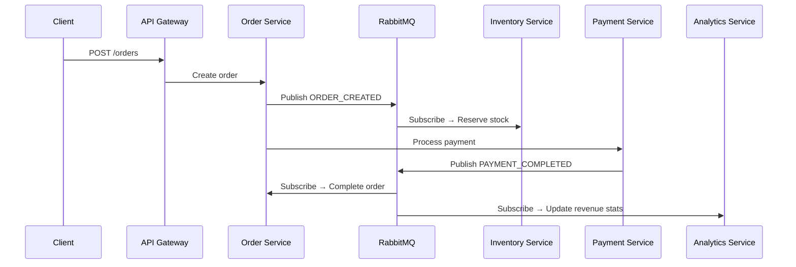

# Coffee Shop Management System

Enterprise-grade microservices-based coffee shop management system with 9 services, React frontend, API gateway, and full observability stack.

---

## 📘 CÂU 1: CLO1 — Hiểu quá trình phân tích, thiết kế dịch vụ sử dụng SOAP, REST và Microservice

### 1.1. Kiến trúc Microservice trong dự án

Dự án **Coffee Shop Management System** được thiết kế theo kiến trúc **Microservices** với các đặc điểm cốt lõi:


#### 🔑 Nguyên tắc thiết kế Microservice:

| Nguyên tắc | Cách triển khai trong dự án |
|---|---|
| **Database per Service** | Mỗi service có MySQL database riêng (8 DBs) |
| **Decentralized Governance** | Mỗi service là 1 Docker container độc lập |
| **API Gateway Pattern** | Express API Gateway tại port 3000 — single entry point |
| **Interservice Communication** | REST (sync) + RabbitMQ (async events) |
| **Circuit Breaker** | Tự build `CircuitBreaker` class với 3 states (CLOSED → OPEN → HALF_OPEN) |
| **Service Discovery** | Consul integration qua `serviceDiscovery.js` |

### 1.2. RESTful API Design

Dự án dùng **REST** (không dùng SOAP vì nặng & phức tạp hơn). Thiết kế REST chuẩn:

```javascript
// swagger.js — OpenAPI 3.0 spec
paths: {
  '/auth/login':     { post: { ... } },  // POST để tạo session
  '/auth/register':  { post: { ... } },  // POST để tạo resource mới
  '/products':       { get: { ... }, post: { ... } },
  '/products/{id}':  { get: { ... }, put: { ... }, delete: { ... } },
}
```

**Chuẩn REST được áp dụng:**
- ✅ **Stateless**: JWT token, không lưu session server
- ✅ **Resource-based URLs**: `/products`, `/orders`, `/categories`
- ✅ **HTTP Methods chuẩn**: GET (read), POST (create), PUT (update), DELETE (delete)
- ✅ **Response format thống nhất**: `ApiResponse` class: `{ success, statusCode, message, data, timestamp }` + `PaginatedResponse` cho phân trang
- ✅ **HATEOAS**: Swagger UI tại `/api/docs` cung cấp toàn bộ API documentation

### 1.3. SOAP vs REST — Lựa chọn thiết kế

| Tiêu chí | SOAP | REST (lựa chọn của dự án) |
|---|---|---|
| Protocol | XML, WSDL | JSON, HTTP |
| Performance | Nặng, parse XML | Nhẹ, parse JSON nhanh |
| State | Có thể stateful | Stateless (JWT) |
| Use case | Enterprise, banking | Web/mobile apps, microservices |
| Complexity | Cao | Thấp hơn |

**Lý do chọn REST:** Coffee shop là hệ thống web/mobile, cần hiệu năng cao, giao tiếp nhẹ giữa React frontend → API Gateway → Microservices. REST + JSON phù hợp hơn SOAP.

---

## 📘 CÂU 2: CLO2 — Áp dụng hoạt động phát triển phần mềm hướng dịch vụ

### 2.1. Phân tích nghiệp vụ (Domain Analysis)

Bài toán: **Quản lý chuỗi cửa hàng cà phê** — cần quản lý: sản phẩm, danh mục, tồn kho, đơn hàng, thanh toán, khách hàng, nhân viên, phân tích doanh thu.

Domain được decompose thành **9 bounded contexts**:

| Bounded Context | Service | Trách nhiệm |
|---|---|---|
| Authentication | auth-service | Đăng nhập, JWT, refresh token, audit logs |
| User Management | user-service | Khách hàng, nhân viên, cài đặt shop |
| Product Catalog | product-service | CRUD sản phẩm (12 seeded), SKU, barcode |
| Category | category-service | Danh mục 5 loại, phân cấp cha-con |
| Inventory | inventory-service | Tồn kho, giao dịch xuất/nhập, cảnh báo thấp |
| Order Processing | order-service | Tạo đơn, tracking trạng thái, Socket.IO realtime |
| Payment | payment-service | Thanh toán đa phương thức, hoàn tiền |
| Analytics | analytics-service | Dashboard, doanh thu, top sản phẩm |
| API Gateway | api-gateway | Routing, auth, RBAC, rate limit, cache |

### 2.2. Giao tiếp giữa các Service

#### 🔄 Synchronous (REST) — Request/Response trực tiếp:

```
Client → API Gateway → Product Service → Response
```

Thông qua `proxy.routes.js`:
- `/api/products/*` → Product Service
- `/api/orders/*` → Order Service

#### 📨 Asynchronous (Event-Driven) — Qua RabbitMQ:

```javascript
// events.js — các sự kiện định nghĩa rõ ràng
ORDER_CREATED    → Inventory Service tự động trừ tồn kho
PAYMENT_COMPLETED → Order Service tự động hoàn thành đơn
ORDER_COMPLETED  → Analytics Service cập nhật doanh thu
```



### 2.3. Distributed Transaction — Saga Pattern

```javascript
// sagaOrchestrator.js — Orchestration-based Saga
const createOrderSaga = (orderApi, inventoryApi, paymentApi) => {
  return new SagaOrchestrator()
    .step('create_order',       // Step 1: Tạo order
      async (ctx) => orderApi.create(ctx.orderData),
      async (ctx) => orderApi.cancel(ctx.orderId))   // Compensate: Hủy order
    .step('reserve_inventory',  // Step 2: Giữ hàng
      async (ctx) => inventoryApi.reserve(ctx.items),
      async (ctx) => inventoryApi.release(ctx.items)) // Compensate: Trả hàng
    .step('process_payment',    // Step 3: Thanh toán
      async (ctx) => paymentApi.process({...}),
      async (ctx) => paymentApi.refund(ctx.paymentId)); // Compensate: Hoàn tiền
};
```

- Nếu tất cả steps thành công → `saga.completed`
- Nếu bất kỳ step nào fail → **compensate ngược** các step đã chạy

### 2.4. Cross-cutting Concerns (tại API Gateway)

Middleware pipeline xử lý tuần tự:

```
Request → Helmet(CSP) → CORS → CorrelationID → RateLimit(100/min)
       → Logger → Auth(JWT) → RBAC(6 roles) → Cache(Redis) 
       → CircuitBreaker → Proxy → Service
```

### 2.5. Security Implementation

```javascript
// RBAC — 6 cấp độ phân quyền
super_admin(1): Toàn quyền hệ thống
admin(2):       Quản trị
manager(3):     Quản lý cửa hàng
cashier(4):     Thu ngân (tạo đơn hàng)
barista(5):     Pha chế (xem đơn)
viewer(6):      Chỉ xem

// Route restriction mapping
{ path: '/api/orders', methods: ['POST'], roles: [1,2,3,4] },      // cashier+ 
{ path: '/api/orders', methods: ['PUT','DELETE'], roles: [1,2,3] }, // manager+
```

### 2.6. DevOps & Observability

```yaml
# docker-compose.yml — Full stack containerization
services:
  mysql, redis, rabbitmq         # Infrastructure
  api-gateway                     # Gateway
  auth-service ... analytics-service  # 8 microservices
  frontend                        # React SPA
  prometheus, grafana             # Monitoring
  jaeger                          # Distributed tracing
  elasticsearch, kibana           # Centralized logging
  consul                          # Service discovery
```

Mỗi service có `/health` endpoint + `/metrics` cho Prometheus scrape + OpenTelemetry tracing.

---

## 📘 CÂU 3: CLO3 — Trình bày kết quả dự án cá nhân

### 3.1. Tổng quan dự án

**Coffee Shop Management System** — Nền tảng quản lý quán cà phê quy mô doanh nghiệp (enterprise-grade), xây dựng từ đầu với kiến trúc Microservices.

### 3.2. Quy mô dự án

| Metric | Con số |
|---|---|
| Microservices | 9 (8 business + 1 gateway) |
| Databases | 8 MySQL databases |
| Frontend pages | 34 routes (10 customer + 3 auth + 21 admin) |
| API endpoints | ~60+ REST endpoints (đầy đủ Swagger docs) |
| Middleware layers | 8 lớp tại API Gateway |
| Infrastructure services | MySQL, Redis, RabbitMQ, Prometheus, Grafana, Jaeger, ELK, Consul |
| Docker containers | 20 containers |

### 3.3. Tính năng nổi bật

| Tính năng | Chi tiết kỹ thuật |
|---|---|
| 🔐 **Xác thực & Phân quyền** | JWT + Refresh Token + RBAC 6 roles + Audit logs |
| 🛒 **Đặt hàng & Thanh toán** | Saga Pattern distributed transaction |
| 📦 **Quản lý tồn kho** | Real-time stock tracking + cảnh báo ngưỡng thấp |
| 📊 **Phân tích kinh doanh** | Materialized views: daily_sales, top_products, hourly_traffic |
| 🖼️ **Upload ảnh** | Multipart upload với preview trong ProductFormPage.jsx |
| ⚡ **Realtime Order Tracking** | Socket.IO trên trang CustomerOrderDetail |
| 🛡️ **Fault Tolerance** | Circuit Breaker (3 trạng thái, tự phục hồi) |
| 📈 **Monitoring** | Prometheus metrics + Grafana dashboards + Jaeger tracing |
| 🎯 **Performance** | Redis cache với TTL + Rate limiting (100 req/min sliding window) |
| 🔒 **Bảo mật** | AES-256-GCM encryption + Helmet CSP headers + Encrypted sensitive data |

### 3.4. Kiến trúc kỹ thuật

```
┌─────────────────────────────────────────────────────────┐
│                   FRONTEND (React 18)                     │
│  Redux Store → Axios Clients → 10 customer + 21 admin    │
│  pages (Menu, Cart, Checkout, Dashboard, Analytics...)   │
└────────────────────┬────────────────────────────────────┘
                     │ REST + JWT
┌────────────────────▼────────────────────────────────────┐
│               API GATEWAY (:3000)                        │
│  Helmet → CORS → CorrelationID → RateLimit → Logger     │
│  → Auth → RBAC → Cache → CircuitBreaker → Proxy         │
└────┬───────┬───────┬───────┬───────┬───────┬────────────┘
     │       │       │       │       │       │
  ┌──▼──┐ ┌─▼──┐ ┌──▼──┐ ┌──▼──┐ ┌──▼──┐ ┌──▼──┐
  │Auth │ │User│ │Prod │ │Cat  │ │Inv  │ │Order│ ... (8 services)
  └──┬──┘ └─┬──┘ └──┬──┘ └──┬──┘ └──┬──┘ └──┬──┘
     │      │       │       │       │       │
  ┌──▼──────▼───────▼───────▼───────▼───────▼──┐
  │       MySQL 8.0 (Database per Service)      │
  └─────────────────────────────────────────────┘
                     ↕
  ┌─────────────────────────────────────────────┐
  │  Redis 7  │  RabbitMQ  │  Jaeger  │  ELK    │
  │  Prometheus │ Grafana  │  Consul            │
  └─────────────────────────────────────────────┘
```

### 3.5. Kết quả đạt được

- ✅ Hệ thống **hoàn chỉnh** với 9 microservices, đầy đủ frontend + backend + infrastructure
- ✅ **Production-ready** với Docker Compose, health checks, logging, monitoring
- ✅ Áp dụng đầy đủ các **design pattern** enterprise: API Gateway, Saga, Circuit Breaker, CQRS (analytics materialized views), Cache-Aside
- ✅ **API documentation** đầy đủ qua Swagger UI
- ✅ **Security-first**: JWT, RBAC, rate limiting, audit trails, mã hóa AES-256
- ✅ **Observability**: Metrics, tracing, centralized logging — sẵn sàng cho production debugging

---

**Tóm lại:** Dự án thể hiện đầy đủ kiến thức từ phân tích domain (DDD bounded contexts), thiết kế RESTful API, triển khai Microservice (database-per-service, event-driven với RabbitMQ, Saga distributed transactions), đến vận hành (Docker, monitoring, security). Một project hoàn chỉnh, enterprise-grade, sẵn sàng deploy production! 🚀

---

## URLs

| Service         | URL                            |
| --------------- | ------------------------------ |
| Frontend        | http://localhost               |
| API Gateway     | http://localhost:3000          |
| Swagger Docs    | http://localhost:3000/api/docs |
| RabbitMQ UI     | http://localhost:15672         |
| Kibana (Logs)   | http://localhost:5601          |
| Jaeger (Traces) | http://localhost:16686         |
| Prometheus      | http://localhost:9090          |
| Grafana         | http://localhost:3008          |
| Consul          | http://localhost:8500          |

## Default Login

- **Email:** `phong@triennguyen.com`
- **Password:** `Phong@2004`
- **Display Name:** PHONG CHỦ SHOP (Admin)

## Running Tests

```bash
cd shared && npm install
npx jest --config jest.config.js
npx jest --config jest.config.js --coverage
```

## Architecture

```
Client → Nginx (Frontend) → API Gateway ──→ Monitoring (Prometheus/Grafana/Jaeger/ELK)
                              │  ↓
                              │  Consul (Service Discovery)
                    ┌─────────┼───────────┐
                    ↓         ↓           ↓
              auth-svc   order-svc   product-svc  ...
              auth_db    order_db    product_db   ...
                    ↓         ↓           ↓
              RabbitMQ (Event Bus)  +  Redis (Cache)
```
